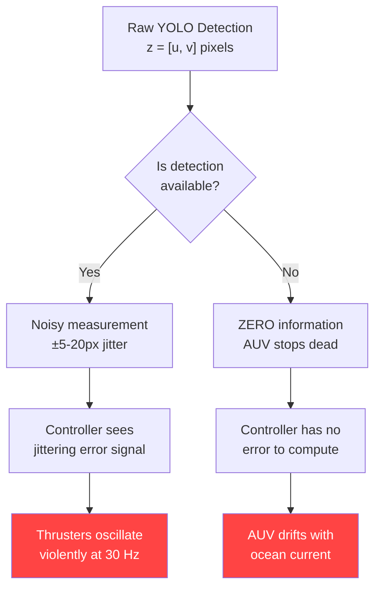
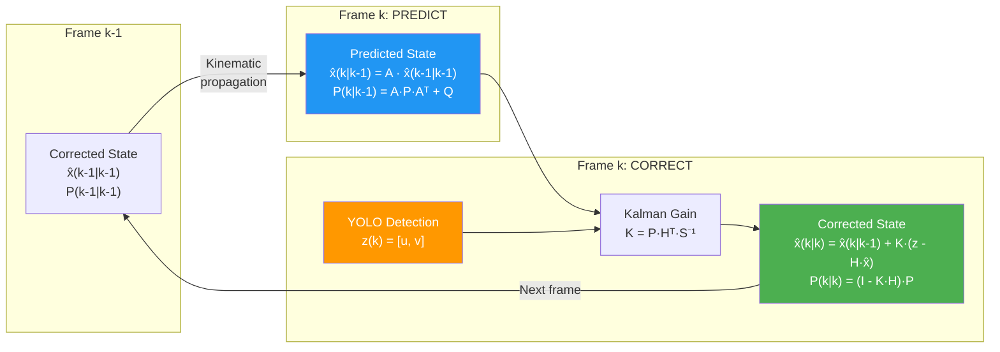
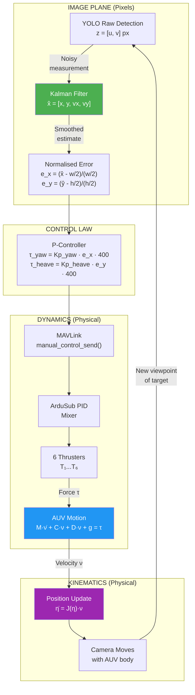
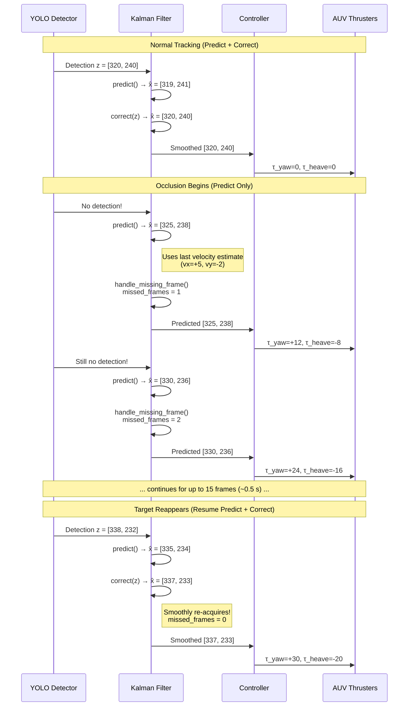

# Comprehensive Analysis: Kalman Filter in the AUV Visual Servoing Control System

> **Author**: Radhi Shafeeq  
> **Context**: Undergraduate Mechatronics Engineering Thesis — Hasanuddin University  
> **System**: Custom 4-DOF AUV with YOLO-based Visual Servoing & Kalman State Estimation

---

## Table of Contents

1. [Introduction & Motivation](#1-introduction--motivation)
2. [AUV Kinematics — How the Vehicle Moves](#2-auv-kinematics--how-the-vehicle-moves)
3. [AUV Dynamics — What Forces Drive the Motion](#3-auv-dynamics--what-forces-drive-the-motion)
4. [The Core Problem: Why Raw Vision Fails](#4-the-core-problem-why-raw-vision-fails)
5. [Kalman Filter Theory — The Mathematical Foundation](#5-kalman-filter-theory--the-mathematical-foundation)
6. [The State-Space Model in Our AUV](#6-the-state-space-model-in-our-auv)
7. [The Two-Step Recursive Cycle: Predict → Correct](#7-the-two-step-recursive-cycle-predict--correct)
8. [Noise Covariance Matrices: Q, R, and P](#8-noise-covariance-matrices-q-r-and-p)
9. [How the Kalman Filter Connects to AUV Kinematics & Dynamics](#9-how-the-kalman-filter-connects-to-auv-kinematics--dynamics)
10. [Occlusion Handling & Dead-Reckoning Prediction](#10-occlusion-handling--dead-reckoning-prediction)
11. [Complete Closed-Loop Signal Flow](#11-complete-closed-loop-signal-flow)
12. [Numerical Example: One Full Cycle](#12-numerical-example-one-full-cycle)
13. [Implementation Mapping to Code](#13-implementation-mapping-to-code)
14. [Summary & Key Takeaways](#14-summary--key-takeaways)
15. [References](#15-references)

---

## 1. Introduction & Motivation

An Autonomous Underwater Vehicle (AUV) that performs **visual target tracking** faces a fundamentally different challenge than land or aerial robots. Underwater, the camera observes a target through a turbid, refractive, poorly-lit medium. Every raw pixel measurement from the YOLO object detector is corrupted by:

- **Detection jitter** — bounding box centres fluctuate by 5–20 px frame-to-frame even when the target is stationary
- **Intermittent occlusion** — bubbles, suspended particles, light refraction, or temporary loss-of-view cause the detector to output **zero detections** for several consecutive frames
- **Latency** — the camera-to-GPU inference pipeline introduces a 30–100 ms delay; the AUV has already moved by the time the detection result arrives

If the thruster controller acts directly on these raw, noisy, intermittent measurements, the AUV will exhibit:

1. **Jerky, oscillating motion** — thrusters rapidly switching direction trying to follow pixel noise
2. **Complete loss of tracking** during occlusion — the AUV stops and drifts with no target information
3. **Phase lag** — control actions based on stale measurements that do not represent the current state

The **Kalman Filter** solves all three problems simultaneously by providing an **optimal, mathematically principled estimate** of where the target *actually is* (and where it is *going*), even when measurements are noisy or missing.

---

## 2. AUV Kinematics — How the Vehicle Moves

### 2.1 Coordinate Frames

Following the SNAME (Society of Naval Architects and Marine Engineers) convention adopted by Fossen (2011), we define two coordinate frames:

| Frame | Symbol | Description |
|-------|--------|-------------|
| **Earth-Fixed (Inertial)** | $\{n\}$ | NED frame (North-East-Down), fixed to the Earth's surface. Gravity acts along the positive $z_n$-axis. |
| **Body-Fixed** | $\{b\}$ | Origin at the AUV's centre of gravity (CG), moves and rotates with the vehicle. $x_b$ points forward (bow), $y_b$ points starboard, $z_b$ points downward. |

### 2.2 The Six Degrees of Freedom

A rigid body submerged in water has six degrees of freedom (DOF). Using the SNAME notation:

| DOF | Motion Type | Body-Frame Velocity | Earth-Frame Position/Angle | Force/Moment |
|-----|-------------|---------------------|----------------------------|--------------|
| 1 — Surge | Translation along $x_b$ | $u$ | $x$ | $X$ |
| 2 — Sway | Translation along $y_b$ | $v$ | $y$ | $Y$ |
| 3 — Heave | Translation along $z_b$ | $w$ | $z$ | $Z$ |
| 4 — Roll | Rotation about $x_b$ | $p$ | $\phi$ | $K$ |
| 5 — Pitch | Rotation about $y_b$ | $q$ | $\theta$ | $M$ |
| 6 — Yaw | Rotation about $z_b$ | $r$ | $\psi$ | $N$ |

> [!IMPORTANT]
> Our custom AUV has **4 controllable DOF** (surge, sway, heave, yaw) with 6 thrusters. Roll ($\phi$) and pitch ($\theta$) are passively stabilised — roll is self-righting because the centre of buoyancy is above the centre of gravity, and pitch is stabilised by the restoring moment from the buoyancy-gravity couple. Neither roll nor pitch is independently actuated by the thrusters.

#### Platform Comparison: ArduSub Frame Types & Controllable DOF

Our custom AUV frame and thruster positions are based on the **BlueROV2 Standard** design. The firmware is the same ArduSub autopilot (developed by ArduPilot & Blue Robotics), and the onboard operating system is **BlueOS** (Blue Robotics). The table below compares the three platforms used in this project's simulation environment:

| Platform | Thrusters | ArduSub Frame | Firmware Controllable Axes | Practical Operational DOF | Passive Axes |
|----------|-----------|---------------|----------------------------|--------------------------|--------------|
| **Custom "Poseidon" AUV** | 6 (4 horizontal, 2 vertical) | `vectored` | R / Y / Z / F / L | **4-DOF**: Surge, Sway, Heave, Yaw | Roll, Pitch |
| **BlueROV2 Standard** | 6 (4 horizontal, 2 vertical) | `vectored` | R / Y / Z / F / L | **4-DOF**: Surge, Sway, Heave, Yaw | Roll, Pitch |
| **BlueROV2 Heavy** | 8 (4 horizontal, 4 vertical) | `vectored_6dof` | R / P / Y / Z / F / L | **6-DOF**: Surge, Sway, Heave, Roll, Pitch, Yaw | None |

where the axes are: R = Roll, P = Pitch, Y = Yaw, Z = Depth (Heave), F = Forward (Surge), L = Lateral (Sway).

> [!NOTE]
> **Firmware vs. Practical DOF**: The ArduSub `vectored` frame lists Roll (R) as a controllable axis because the two vertical thrusters are laterally offset and *can* produce a small roll moment through differential thrust. However, in practice under **Stabilize** and **Depth Hold** flight modes — the modes used for visual-servoing tracking — ArduSub's internal PID controller actively auto-levels the vehicle using IMU feedback. Roll and pitch inputs require a special `roll_pitch_toggle` joystick function that is not mapped by default in Cockpit. Furthermore, the roll authority from only two vertical thrusters is limited. In the Gazebo SITL simulation, neither the BlueROV2 Standard nor the custom AUV exhibit independent roll or pitch control. For these reasons, both are classified as **4-DOF operational** platforms.
>
> The BlueROV2 Heavy's four vertical thrusters (positioned at the four corners of the frame) provide sufficient differential thrust for **active roll and pitch control**, making it a true 6-DOF platform even in stabilised flight modes.

### 2.3 Kinematic Vectors

We define the generalised position and velocity vectors:

$$\boldsymbol{\eta} = \begin{bmatrix} \boldsymbol{\eta}_1 \\ \boldsymbol{\eta}_2 \end{bmatrix} = \begin{bmatrix} x & y & z & \phi & \theta & \psi \end{bmatrix}^T$$

$$\boldsymbol{\nu} = \begin{bmatrix} \boldsymbol{\nu}_1 \\ \boldsymbol{\nu}_2 \end{bmatrix} = \begin{bmatrix} u & v & w & p & q & r \end{bmatrix}^T$$

### 2.4 The Kinematic Equation

The relationship between earth-frame position rate-of-change and body-frame velocities is:

$$\dot{\boldsymbol{\eta}} = \mathbf{J}(\boldsymbol{\eta}_2) \, \boldsymbol{\nu}$$

where $\mathbf{J}(\boldsymbol{\eta}_2)$ is the **6×6 Jacobian transformation matrix** composed of two sub-matrices:

$$\mathbf{J}(\boldsymbol{\eta}_2) = \begin{bmatrix} \mathbf{R}(\phi, \theta, \psi) & \mathbf{0}_{3\times3} \\ \mathbf{0}_{3\times3} & \mathbf{T}(\phi, \theta) \end{bmatrix}$$

**$\mathbf{R}(\phi, \theta, \psi)$** is the rotation matrix (using ZYX Euler angles) that transforms linear velocities from the body frame to the earth frame:

$$\mathbf{R} = \begin{bmatrix} c\psi c\theta & c\psi s\theta s\phi - s\psi c\phi & c\psi s\theta c\phi + s\psi s\phi \\ s\psi c\theta & s\psi s\theta s\phi + c\psi c\phi & s\psi s\theta c\phi - c\psi s\phi \\ -s\theta & c\theta s\phi & c\theta c\phi \end{bmatrix}$$

where $c(\cdot) = \cos(\cdot)$ and $s(\cdot) = \sin(\cdot)$.

**$\mathbf{T}(\phi, \theta)$** transforms angular velocities from body to earth frame:

$$\mathbf{T} = \begin{bmatrix} 1 & s\phi \tan\theta & c\phi \tan\theta \\ 0 & c\phi & -s\phi \\ 0 & s\phi / c\theta & c\phi / c\theta \end{bmatrix}$$

> [!NOTE]
> **Physical meaning**: Kinematics tells us *how position changes* given a velocity, but says nothing about *what forces produce that velocity*. That is the domain of dynamics.

---

## 3. AUV Dynamics — What Forces Drive the Motion

### 3.1 Fossen's 6-DOF Equation of Motion

The dynamics of a rigid body moving through a viscous fluid are described by Fossen's vector equation:

$$\mathbf{M} \dot{\boldsymbol{\nu}} + \mathbf{C}(\boldsymbol{\nu})\boldsymbol{\nu} + \mathbf{D}(\boldsymbol{\nu})\boldsymbol{\nu} + \mathbf{g}(\boldsymbol{\eta}) = \boldsymbol{\tau}$$

Each term represents a distinct physical phenomenon:

### 3.2 Term-by-Term Breakdown

#### $\mathbf{M}\dot{\boldsymbol{\nu}}$ — Inertial Forces

$$\mathbf{M} = \mathbf{M}_{RB} + \mathbf{M}_A$$

| Component | Description |
|-----------|-------------|
| $\mathbf{M}_{RB}$ | **Rigid-body inertia matrix** (6×6). Depends on the AUV's mass $m = 14.2\,\text{kg}$ and moments of inertia $I_{xx}, I_{yy}, I_{zz}$. Diagonal elements represent resistance to linear and angular acceleration. |
| $\mathbf{M}_A$ | **Added mass matrix** (6×6). When the AUV accelerates, it must also accelerate a volume of surrounding water. This "virtual mass" effect is significant underwater — typically 20–60% of the rigid-body mass for a streamlined hull. |

For our AUV ($m = 14.2\,\text{kg}$, $I_{xx} = I_{yy} = I_{zz} = 0.13\,\text{kg·m}^2$):

$$\mathbf{M}_{RB} = \begin{bmatrix} 14.2 & 0 & 0 & 0 & 0 & 0 \\ 0 & 14.2 & 0 & 0 & 0 & 0 \\ 0 & 0 & 14.2 & 0 & 0 & 0 \\ 0 & 0 & 0 & 0.13 & 0 & 0 \\ 0 & 0 & 0 & 0 & 0.13 & 0 \\ 0 & 0 & 0 & 0 & 0 & 0.13 \end{bmatrix}$$

#### $\mathbf{C}(\boldsymbol{\nu})\boldsymbol{\nu}$ — Coriolis and Centripetal Forces

When the AUV rotates while also translating, Coriolis and centripetal forces appear. These are **velocity-dependent coupling terms** — for example, yawing while surging creates an apparent sideways (sway) force. $\mathbf{C}$ is a function of $\boldsymbol{\nu}$ and is skew-symmetric.

#### $\mathbf{D}(\boldsymbol{\nu})\boldsymbol{\nu}$ — Hydrodynamic Damping (Drag)

This is the dominant resistance force underwater. It has two components:

$$\mathbf{D}(\boldsymbol{\nu}) = \mathbf{D}_l + \mathbf{D}_q(\boldsymbol{\nu})$$

| Component | Form | Description |
|-----------|------|-------------|
| **Linear drag** $\mathbf{D}_l$ | $\mathbf{D}_l \boldsymbol{\nu}$ | Proportional to velocity. Dominates at low speeds (skin friction). |
| **Quadratic drag** $\mathbf{D}_q$ | $\mathbf{D}_q(\boldsymbol{\nu})\boldsymbol{\nu}$ | Proportional to $|\nu|\nu$. Dominates at moderate-to-high speeds (pressure drag). |

From our `model.sdf`, the quadratic drag coefficients are:

| Coefficient | Value | Physical Meaning |
|-------------|-------|------------------|
| $X_{u|u|}$ | $-33.732$ | Surge drag — resistance to forward/backward motion |
| $Y_{v|v|}$ | $-54.16$ | Sway drag — resistance to lateral motion (higher due to larger cross-section) |
| $Z_{w|w|}$ | $-73.225$ | Heave drag — resistance to vertical motion (highest due to largest projected area) |

> [!TIP]
> **Why sway drag > surge drag**: The AUV hull is elongated along the surge axis. Moving sideways presents a much larger frontal area to the water, creating greater resistance. This asymmetry means that sway motion requires more thruster effort per unit velocity than surge, which the controller must account for when commanding lateral translations.

#### $\mathbf{g}(\boldsymbol{\eta})$ — Gravitational and Buoyancy Restoring Forces

$$\mathbf{g}(\boldsymbol{\eta}) = \begin{bmatrix} (W - B)\sin\theta \\ -(W - B)\cos\theta\sin\phi \\ -(W - B)\cos\theta\cos\phi \\ -\overline{BG}_z B \cos\theta\sin\phi \\ -\overline{BG}_z B \sin\theta \\ 0 \end{bmatrix}$$

where:
- $W = mg = 14.2 \times 9.81 = 139.3\,\text{N}$ is the weight force
- $B = \rho_{water} \cdot V_{displaced} \cdot g = 998 \times 0.011 \times 9.81 = 107.7\,\text{N}$ is the buoyancy force
- $\overline{BG}_z$ is the vertical distance between the centre of buoyancy (CB) and the centre of gravity (CG)

> [!IMPORTANT]
> In our AUV (and the BlueROV2 Standard), the CB is placed **above** the CG ($\overline{BG}_z = 0.15\,\text{m}$). This creates a passive **righting moment**: if the AUV rolls or pitches, the buoyancy-gravity couple automatically restores it to level. For 4-DOF platforms (custom AUV and BlueROV2 Standard), this passive stability is the *only* mechanism maintaining roll and pitch — the thrusters do not actively correct attitude. For the BlueROV2 Heavy (6-DOF), the restoring moment supplements the active attitude control provided by its four vertical thrusters, giving it double-layered stability.

#### $\boldsymbol{\tau}$ — Thruster Forces and Moments

The control input vector produced by the thrusters:

$$\boldsymbol{\tau} = \begin{bmatrix} X_{thrust} \\ Y_{thrust} \\ Z_{thrust} \\ K_{thrust} \\ M_{thrust} \\ N_{thrust} \end{bmatrix} = \mathbf{T}_{config} \cdot \mathbf{f}$$

where $\mathbf{T}_{config}$ is the **thruster configuration matrix** that maps individual thruster forces $\mathbf{f}$ to body-frame forces and moments based on each thruster's position and orientation. The matrix dimensions depend on the number of thrusters.

**Custom AUV / BlueROV2 Standard (6 thrusters, `vectored` frame):**

$\mathbf{T}_{config}$ is 6×6, mapping $\mathbf{f} = [f_1, f_2, f_3, f_4, f_5, f_6]^T$:
- **Thrusters 1–4** (horizontal, angled at ±45°): produce surge, sway, and yaw
- **Thrusters 5–6** (vertical, laterally offset at $y = \pm 0.109\,\text{m}$): produce heave
- Roll/pitch moments from thrusters 5–6 are minimal and not actively commanded

**BlueROV2 Heavy (8 thrusters, `vectored_6dof` frame):**

$\mathbf{T}_{config}$ is 6×8, mapping $\mathbf{f} = [f_1, \ldots, f_8]^T$:
- **Thrusters 1–4** (horizontal, angled at ±45°): produce surge, sway, and yaw
- **Thrusters 5–8** (vertical, positioned at four corners): produce heave, roll, and pitch through differential thrust

> [!NOTE]
> The ArduSub firmware uses the `add_motor_raw_6dof()` function to define each motor's contribution factors (`roll_fac`, `pitch_fac`, `yaw_fac`, `throttle_fac`, `forward_fac`, `lateral_fac`) in the `AP_Motors6DOF.cpp` library. The `MOT_FV_CPLNG_K` parameter (default 1.0) provides forward/vertical-to-pitch hydrodynamic decoupling for vectored frames.

---

## 4. The Core Problem: Why Raw Vision Fails

### 4.1 The Visual Servoing Architecture

Our AUV uses **Image-Based Visual Servoing (IBVS)**. The camera is body-fixed, looking forward. The control law operates directly in the **image plane** (pixel coordinates), not in the 3D world frame:

```
Camera Frame → YOLO Detection → Pixel Error → Controller → Thruster Commands
```

The target's position in the image is:

$$\mathbf{s} = \begin{bmatrix} u_{target} \\ v_{target} \end{bmatrix} \quad \text{(pixel coordinates)}$$

The desired position is the frame centre:

$$\mathbf{s}^* = \begin{bmatrix} u_{center} \\ v_{center} \end{bmatrix} = \begin{bmatrix} w/2 \\ h/2 \end{bmatrix}$$

The image error vector is:

$$\mathbf{e} = \mathbf{s} - \mathbf{s}^* = \begin{bmatrix} u_{target} - w/2 \\ v_{target} - h/2 \end{bmatrix}$$

The proportional controller then maps this error to thruster commands:

$$\tau_{yaw} = K_{p,yaw} \cdot e_x, \qquad \tau_{heave} = K_{p,heave} \cdot e_y$$

### 4.2 The Three Failure Modes Without a Kalman Filter



**Failure 1 — Measurement Jitter → Thruster Oscillation**

Even when tracking a stationary target, consecutive YOLO detections fluctuate:

| Frame | Raw $u$ (px) | Raw $v$ (px) | $\Delta u$ | $\Delta v$ |
|-------|------------|------------|-----------|-----------|
| $k$ | 318 | 242 | — | — |
| $k+1$ | 325 | 237 | +7 | −5 |
| $k+2$ | 314 | 245 | −11 | +8 |
| $k+3$ | 329 | 233 | +15 | −12 |

The controller interprets each fluctuation as real target motion and commands the thrusters to compensate. At 30 fps, this creates a 30 Hz oscillation in thruster commands — mechanical vibration, wasted energy, and acoustic noise.

**Failure 2 — Occlusion → Complete Track Loss**

When bubbles, murky water, or light glare cause YOLO to return zero detections, the controller receives **no error signal**. It cannot command any correction. The AUV drifts passively with any ambient current, and when the target reappears, it may have moved far from the frame centre, causing a sudden large correction that overshoots.

**Failure 3 — Latency → Phase Lag**

The camera-to-controller pipeline has ~33 ms latency (1 frame at 30 fps). If the target moves at 50 px/s, by the time the controller acts on frame $k$, the target has already moved 1.7 px. The controller is always "chasing" the target's past position.

---

## 5. Kalman Filter Theory — The Mathematical Foundation

### 5.1 What Is the Kalman Filter?

The Kalman Filter (Kalman, 1960) is a **recursive, optimal state estimator** for linear dynamical systems with Gaussian noise. "Optimal" means it minimises the mean squared error of the state estimate, given:

1. A **process model** describing how the system evolves over time
2. A **measurement model** describing how observations relate to the state
3. Statistical characterisations of the **process noise** and **measurement noise**

### 5.2 Why "Optimal"?

Among all possible linear estimators, the Kalman Filter produces the estimate with the **minimum variance** (smallest uncertainty). For Gaussian noise, this is also the **maximum likelihood** and **maximum a posteriori** estimate. No linear filter can do better.

### 5.3 Why Not Just Average?

A simple moving average (e.g., average the last 5 detections) also smooths noise, but it:

- Introduces **fixed latency** (the average lags behind the true position)
- Cannot **predict** during occlusion (it has no motion model)
- Treats all measurements equally (cannot weight high-confidence detections more)
- Cannot estimate **velocity** (only position)

The Kalman Filter addresses all of these by incorporating a **physics-based motion model** and **adaptive weighting** based on uncertainty.

---

## 6. The State-Space Model in Our AUV

### 6.1 State Vector

We model the target's motion in the image plane with a **4-dimensional state vector**:

$$\mathbf{x}_k = \begin{bmatrix} x_k \\ y_k \\ \dot{x}_k \\ \dot{y}_k \end{bmatrix} = \begin{bmatrix} \text{target horizontal position (px)} \\ \text{target vertical position (px)} \\ \text{target horizontal velocity (px/frame)} \\ \text{target vertical velocity (px/frame)} \end{bmatrix}$$

### 6.2 Process Model (State Transition)

We assume a **constant-velocity motion model**: between frames, the target moves at approximately constant velocity. This is the discrete-time kinematic equation:

$$\mathbf{x}_{k} = \mathbf{A} \mathbf{x}_{k-1} + \mathbf{w}_{k-1}$$

where the **state transition matrix** $\mathbf{A}$ encodes the constant-velocity kinematics:

$$\mathbf{A} = \begin{bmatrix} 1 & 0 & \Delta t & 0 \\ 0 & 1 & 0 & \Delta t \\ 0 & 0 & 1 & 0 \\ 0 & 0 & 0 & 1 \end{bmatrix}$$

with $\Delta t = 0.033\,\text{s}$ (one frame at 30 fps).

**Expanding the matrix multiplication explicitly**:

$$\begin{bmatrix} x_k \\ y_k \\ \dot{x}_k \\ \dot{y}_k \end{bmatrix} = \begin{bmatrix} 1 & 0 & 0.033 & 0 \\ 0 & 1 & 0 & 0.033 \\ 0 & 0 & 1 & 0 \\ 0 & 0 & 0 & 1 \end{bmatrix} \begin{bmatrix} x_{k-1} \\ y_{k-1} \\ \dot{x}_{k-1} \\ \dot{y}_{k-1} \end{bmatrix}$$

This gives the intuitive kinematic equations:

$$x_k = x_{k-1} + \dot{x}_{k-1} \cdot \Delta t$$
$$y_k = y_{k-1} + \dot{y}_{k-1} \cdot \Delta t$$
$$\dot{x}_k = \dot{x}_{k-1}$$
$$\dot{y}_k = \dot{y}_{k-1}$$

> [!NOTE]
> **Connection to AUV kinematics**: This is the discrete, 2D image-plane analogue of the kinematic equation $\dot{\boldsymbol{\eta}} = \mathbf{J}\boldsymbol{\nu}$. In the full 6-DOF formulation, position updates depend on velocity through the Jacobian. Here, in the image plane, the relationship simplifies to linear translation because we track pixel coordinates directly.

### 6.3 Measurement Model

The camera provides only **position** measurements (the bounding box centre from YOLO). Velocity is not directly measured — it must be **inferred** by the filter. The measurement equation is:

$$\mathbf{z}_k = \mathbf{H} \mathbf{x}_k + \mathbf{v}_k$$

where the **measurement matrix** $\mathbf{H}$ extracts only the position components:

$$\mathbf{H} = \begin{bmatrix} 1 & 0 & 0 & 0 \\ 0 & 1 & 0 & 0 \end{bmatrix}$$

and $\mathbf{z}_k = [z_x, z_y]^T$ is the raw YOLO bounding box centre in pixels.

**What $\mathbf{H}$ means physically**: The camera can see *where* the target is, but cannot directly see *how fast* it is moving. The Kalman Filter cleverly infers velocity by observing how position changes over time.

### 6.4 Noise Models

$$\mathbf{w}_k \sim \mathcal{N}(\mathbf{0}, \mathbf{Q}) \qquad \text{(process noise — model uncertainty)}$$
$$\mathbf{v}_k \sim \mathcal{N}(\mathbf{0}, \mathbf{R}) \qquad \text{(measurement noise — sensor uncertainty)}$$

Both are assumed to be **zero-mean Gaussian** and **mutually uncorrelated**.

---

## 7. The Two-Step Recursive Cycle: Predict → Correct

Every frame, the Kalman Filter executes exactly two steps. This is the core algorithm:

### 7.1 Step 1 — PREDICT (Time Update / Propagation)

*"Where do I think the target will be, based on physics alone?"*

**Predicted State Estimate** (a priori):

$$\hat{\mathbf{x}}_{k|k-1} = \mathbf{A} \hat{\mathbf{x}}_{k-1|k-1}$$

**Predicted Error Covariance** (a priori):

$$\mathbf{P}_{k|k-1} = \mathbf{A} \mathbf{P}_{k-1|k-1} \mathbf{A}^T + \mathbf{Q}$$

> **Physical interpretation**: We propagate the last known state forward in time using the kinematic model. The uncertainty ($\mathbf{P}$) **grows** because we are extrapolating — the longer we go without a measurement, the less certain we become. $\mathbf{Q}$ quantifies how much the constant-velocity assumption can be wrong.

### 7.2 Step 2 — CORRECT (Measurement Update)

*"Now I have a new YOLO detection. How do I combine it with my prediction?"*

**Innovation (Measurement Residual)**:

$$\tilde{\mathbf{y}}_k = \mathbf{z}_k - \mathbf{H} \hat{\mathbf{x}}_{k|k-1}$$

This is the difference between what we *measured* and what we *predicted*. A large innovation means the measurement is surprising.

**Innovation Covariance**:

$$\mathbf{S}_k = \mathbf{H} \mathbf{P}_{k|k-1} \mathbf{H}^T + \mathbf{R}$$

**Kalman Gain**:

$$\mathbf{K}_k = \mathbf{P}_{k|k-1} \mathbf{H}^T \mathbf{S}_k^{-1}$$

> [!IMPORTANT]
> **The Kalman Gain $\mathbf{K}$ is the key insight of the entire filter.** It is a matrix that determines how much to trust the new measurement versus the prediction:
> - If $\mathbf{R}$ is large (noisy sensor) → $\mathbf{K}$ is small → trust the prediction more
> - If $\mathbf{P}$ is large (uncertain model) → $\mathbf{K}$ is large → trust the measurement more
> - The gain is **computed automatically** at each frame based on the current uncertainty — no manual tuning of this balance is needed.

**Corrected State Estimate** (a posteriori):

$$\hat{\mathbf{x}}_{k|k} = \hat{\mathbf{x}}_{k|k-1} + \mathbf{K}_k \tilde{\mathbf{y}}_k$$

**Corrected Error Covariance** (a posteriori):

$$\mathbf{P}_{k|k} = (\mathbf{I} - \mathbf{K}_k \mathbf{H}) \mathbf{P}_{k|k-1}$$

> **Physical interpretation**: The corrected state is a **weighted blend** of the prediction and the measurement. The uncertainty ($\mathbf{P}$) **shrinks** after incorporating a measurement — we are now more certain about the target's state.

### 7.3 The Predict–Correct Cycle Visualised



---

## 8. Noise Covariance Matrices: Q, R, and P

### 8.1 Process Noise $\mathbf{Q}$ — How Much the Model Can Be Wrong

$$\mathbf{Q} = \sigma_q^2 \cdot \mathbf{I}_4 = (0.05)^2 \cdot \begin{bmatrix} 1 & 0 & 0 & 0 \\ 0 & 1 & 0 & 0 \\ 0 & 0 & 1 & 0 \\ 0 & 0 & 0 & 1 \end{bmatrix} = \begin{bmatrix} 0.0025 & 0 & 0 & 0 \\ 0 & 0.0025 & 0 & 0 \\ 0 & 0 & 0.0025 & 0 \\ 0 & 0 & 0 & 0.0025 \end{bmatrix}$$

**Physical meaning**: $\sigma_q = 0.05$ means we expect the constant-velocity model to be accurate to within $\pm 0.05$ px/frame. This is **small**, reflecting our belief that targets underwater generally move smoothly (they do not teleport or make instant 90° turns).

**Effect of tuning $\mathbf{Q}$**:
- $\mathbf{Q}$ too small → filter is overconfident in the model → sluggish response to real motion changes, overshooting on turns
- $\mathbf{Q}$ too large → filter doubts the model → output becomes noisy like the raw measurements, losing the smoothing benefit

### 8.2 Measurement Noise $\mathbf{R}$ — How Noisy the YOLO Detections Are

$$\mathbf{R} = \sigma_r^2 \cdot \mathbf{I}_2 = (0.2)^2 \cdot \begin{bmatrix} 1 & 0 \\ 0 & 1 \end{bmatrix} = \begin{bmatrix} 0.04 & 0 \\ 0 & 0.04 \end{bmatrix}$$

**Physical meaning**: $\sigma_r = 0.2$ represents the expected standard deviation of YOLO bounding-box centre jitter in normalised coordinates. This accounts for:
- Bounding box size fluctuations
- Sub-pixel detector inconsistency
- Underwater light refraction distortion

**The ratio $\mathbf{Q}/\mathbf{R}$ controls the filter's behaviour**:

| Ratio $\sigma_q / \sigma_r$ | Filter Behaviour | Analogy |
|------------------------------|-------------------|---------|
| $\ll 1$ (our case: 0.25) | **Strongly smoothing** — trusts model, dampens noise | Like a heavy flywheel: stable but slow to respond |
| $\approx 1$ | Balanced — equal trust in model and sensor | Moderate smoothing |
| $\gg 1$ | **Reactive** — trusts sensor, less smoothing | Like raw sensor pass-through |

Our ratio of $0.05/0.2 = 0.25$ produces **strong smoothing**, which is ideal for thruster jitter elimination.

### 8.3 Error Covariance $\mathbf{P}$ — Our Current Uncertainty

$\mathbf{P}$ is initialised as $\mathbf{I}_4$ (identity) and evolves dynamically:

- **After PREDICT**: $\mathbf{P}$ grows (uncertainty increases because we extrapolated)
- **After CORRECT**: $\mathbf{P}$ shrinks (uncertainty decreases because we got new information)
- **During occlusion** (predict-only, no correction): $\mathbf{P}$ grows continuously, reflecting our decreasing confidence

---

## 9. How the Kalman Filter Connects to AUV Kinematics & Dynamics

### 9.1 The Bridge Between Pixel Space and Physical Motion

The Kalman Filter operates in **pixel coordinates**, but its effects propagate directly into the AUV's physical motion through the control loop:



### 9.2 The Kalman Filter's Role at Each Stage

| Stage | Without Kalman Filter | With Kalman Filter |
|-------|----------------------|-------------------|
| **Measurement** | Raw $[u, v]$ with ±15 px jitter | Smoothed $[\hat{x}, \hat{y}]$ with ~±2 px variation |
| **Error Signal** | Oscillates rapidly, sign changes frame-to-frame | Smooth, monotonic convergence toward zero |
| **Yaw Command** | $\tau_{yaw}$ flips between +60 and −60 at 30 Hz | $\tau_{yaw}$ changes gradually: 50 → 40 → 30 → ... |
| **Thruster Response** | Motors whine and vibrate, current spikes, mechanical stress | Smooth thrust ramps, efficient energy use |
| **AUV Trajectory** | Jerky zigzag path with overshoot | Smooth, direct approach to target |
| **During Occlusion** | AUV stops; drifts; loses target | AUV continues on predicted trajectory for up to 0.5 s |

### 9.3 Effect on Each Dynamic Term

The Kalman Filter indirectly improves every term in the dynamic equation:

**Inertial term $\mathbf{M}\dot{\boldsymbol{\nu}}$**: Smooth control signals mean smooth acceleration demands. Without the filter, $\dot{\boldsymbol{\nu}}$ oscillates wildly, requiring large instantaneous forces from the thrusters. The added mass effect amplifies this — accelerating turbulent water around the hull wastes energy.

**Coriolis term $\mathbf{C}(\boldsymbol{\nu})\boldsymbol{\nu}$**: Erratic yaw-surge coupling is minimised. When the yaw command is smooth, the cross-coupling terms remain small and predictable.

**Damping term $\mathbf{D}(\boldsymbol{\nu})\boldsymbol{\nu}$**: Quadratic drag means that oscillating velocities waste disproportionate energy. If the AUV alternates between $+v$ and $-v$, the drag energy is $2D|v|v$, but a smooth constant velocity $v/2$ only costs $D|v/2|(v/2) = D v^2/4$ — **four times less drag energy** for the same average displacement.

**Restoring term $\mathbf{g}(\boldsymbol{\eta})$**: Jerky heave commands disturb the AUV's pitch equilibrium. A sudden downward thrust tilts the AUV nose-down (pitch), triggering the restoring moment to oscillate. Smooth heave commands keep the AUV level.

### 9.4 Kalman Filter Applicability Across ROV/AUV Platforms

The Kalman Filter's benefit varies depending on how many DOF the platform actively controls:

#### Custom AUV / BlueROV2 Standard (4-DOF: Surge, Sway, Heave, Yaw)

The KF smooths the **yaw** and **heave** commands derived from YOLO visual servoing. Since roll and pitch are passively stabilised (no active thruster control), the KF's smoothing effect on heave is particularly critical:

- **Without KF**: Jerky heave commands from noisy detections create sudden vertical accelerations. These accelerations disturb the pitch equilibrium, and the *only* mechanism to restore pitch is the passive buoyancy-gravity couple ($\mathbf{g}(\boldsymbol{\eta})$), which responds slowly and can oscillate.
- **With KF**: Smooth heave commands minimise pitch disturbances. The AUV maintains a level attitude because the restoring moment is never significantly excited.

For these 4-DOF platforms, the KF is **essential** for attitude stability — it is the *only* protection against pitch/roll disturbances, since there are no thrusters to actively correct them.

#### BlueROV2 Heavy (6-DOF: Surge, Sway, Heave, Roll, Pitch, Yaw)

The KF smooths **all six** control axes. The Heavy configuration has active roll and pitch control via its four vertical thrusters, so the ArduSub PID controller can actively correct attitude disturbances. However, the KF still provides major benefits:

- **Without KF**: Jerky commands excite attitude disturbances that the PID must constantly correct, consuming additional thruster energy and creating secondary oscillations.
- **With KF**: Smooth commands prevent attitude disturbances from occurring in the first place, allowing the PID to focus on maintaining precision rather than fighting noise-induced oscillations.

For the 6-DOF platform, the KF provides a **performance and efficiency** improvement — the Heavy can survive without it (the PIDs will compensate), but with the KF, the system operates more smoothly, uses less energy, and provides better tracking accuracy.

| Aspect | 4-DOF (Custom / Standard) | 6-DOF (Heavy) |
|--------|---------------------------|---------------|
| **KF role for attitude** | Critical — only protection against pitch/roll disturbance | Beneficial — prevents disturbances the PID would otherwise fight |
| **Heave smoothing** | Essential — prevents pitch oscillation | Helpful — reduces PID workload |
| **Yaw smoothing** | Essential — prevents Coriolis cross-coupling | Helpful — reduces yaw-surge coupling |
| **Occlusion handling** | Identical — constant-velocity dead reckoning for both | Identical |
| **Energy savings** | Large — quadratic drag reduction from smooth motion | Large — same mechanism, plus reduced attitude correction thrust |

---

## 10. Occlusion Handling & Dead-Reckoning Prediction

### 10.1 What Happens During Occlusion

When YOLO returns zero detections (turbidity, bubbles, glare), the Kalman Filter switches to **predict-only mode** — also known as **dead reckoning** in navigation terminology:



### 10.2 The 15-Frame Safety Limit

After **15 consecutive missed frames** (~0.5 seconds), the filter resets (`initialized = False`). This prevents the filter from extrapolating indefinitely on a stale velocity estimate, which would eventually diverge from reality.

**Why 15 frames?** This is a balance between:
- **Too few** (e.g., 3 frames): Frequent resets during minor turbidity → jumpy re-acquisition
- **Too many** (e.g., 60 frames): Prediction diverges significantly → large error when target reappears

At typical AUV speeds, 15 frames allows the vehicle to coast through a 0.5 s bubble cloud or momentary glare event without losing the tracking lock.

### 10.3 Growing Uncertainty During Prediction

During predict-only mode, the covariance $\mathbf{P}$ grows at each step:

$$\mathbf{P}_{k|k-1} = \mathbf{A} \mathbf{P}_{k-1|k-1} \mathbf{A}^T + \mathbf{Q}$$

Since no correction step shrinks $\mathbf{P}$, the position uncertainty **increases linearly** (approximately $\sigma_q \cdot \sqrt{n}$ after $n$ predict-only steps). When a detection finally arrives, the Kalman Gain $\mathbf{K}$ will be **larger than usual**, meaning the filter will trust the new measurement more heavily — this is correct behaviour, because our prediction has become increasingly uncertain.

---

## 11. Complete Closed-Loop Signal Flow

### 11.1 End-to-End Data Flow

```
┌─────────────────────────────────────────────────────────────────────────────┐
│                        AUV VISUAL SERVOING LOOP                            │
│                                                                             │
│   ┌──────────┐   RTSP/UDP    ┌──────────┐   z_k        ┌──────────────┐   │
│   │  RPi 4B  │──────────────→│   YOLO   │────────────→│ KALMAN FILTER │   │
│   │  Camera  │   H.264       │  (GPU)   │  [u, v]     │              │   │
│   └──────────┘               └──────────┘  Raw px      │  predict()   │   │
│        ↑                                                │  correct()   │   │
│        │                                                │              │   │
│        │                                                │  State:      │   │
│        │                                                │  x̂=[x,y,    │   │
│        │                                                │     vx,vy]   │   │
│        │                                                └──────┬───────┘   │
│        │                                                       │           │
│        │                                               Smoothed [x̂, ŷ]    │
│        │                                                       │           │
│        │                                                       ▼           │
│        │                                              ┌────────────────┐   │
│        │                                              │  ERROR CALC    │   │
│        │                                              │  ex = (x̂-cx)  │   │
│        │                                              │       /(w/2)  │   │
│        │                                              │  ey = (ŷ-cy)  │   │
│        │                                              │       /(h/2)  │   │
│        │                                              └───────┬────────┘   │
│        │                                                      │            │
│        │                                              ┌───────▼────────┐   │
│        │                                              │ P-CONTROLLER   │   │
│        │                                              │ yaw = Kp·ex   │   │
│        │                                              │ heave = Kp·ey │   │
│        │                                              └───────┬────────┘   │
│        │                                                      │            │
│        │         ┌──────────┐  PWM     ┌──────────┐  MAVLink  │            │
│        │         │ 6 × ESC  │←─────────│ ArduSub  │←──────────┘            │
│        │         │ + Motors │          │ (Pixhawk)│  manual_control        │
│        │         └─────┬────┘          └──────────┘                        │
│        │               │                                                   │
│        │           Force τ                                                 │
│        │               ▼                                                   │
│        │      ┌────────────────────────────────────────┐                   │
│        │      │         AUV DYNAMICS                   │                   │
│        │      │  M·ν̇ + C(ν)·ν + D(ν)·ν + g(η) = τ    │                   │
│        │      │                                        │                   │
│        │      │  → Produces body velocity ν            │                   │
│        │      └────────────────┬───────────────────────┘                   │
│        │                       │                                           │
│        │                   ν = [u,v,w,p,q,r]                              │
│        │                       ▼                                           │
│        │      ┌────────────────────────────────────────┐                   │
│        │      │         AUV KINEMATICS                 │                   │
│        │      │  η̇ = J(η) · ν                         │                   │
│        │      │                                        │                   │
│        │      │  → Produces earth-frame pose η         │                   │
│        │      └────────────────┬───────────────────────┘                   │
│        │                       │                                           │
│        │                  New position                                     │
│        │                  & orientation                                    │
│        └───────────────────────┘                                           │
│              Camera viewpoint changes                                      │
│              → Target appears at new pixel location                        │
│              → Loop repeats at 30 Hz                                       │
└─────────────────────────────────────────────────────────────────────────────┘
```

### 11.2 The Kalman Filter's Three Outputs and Their Effects

| KF Output | Value | Fed To | Effect on AUV Dynamics |
|-----------|-------|--------|----------------------|
| Smoothed position $[\hat{x}, \hat{y}]$ | Filtered pixel coords | Error calculation → P-controller | Smooth $\boldsymbol{\tau}$ → smooth $\dot{\boldsymbol{\nu}}$ → reduced inertial forces, less added-mass energy waste |
| Estimated velocity $[\hat{v}_x, \hat{v}_y]$ | px/frame | HUD display (future: predictive controller) | Enables anticipating target motion rather than purely reacting |
| Predicted position (occlusion) | Extrapolated coords | Error calculation (as fallback) | Maintains tracking through brief occlusions → continuous $\boldsymbol{\tau}$ → no abrupt stops/starts |

---

## 12. Numerical Example: One Full Cycle

### Setup
- Frame size: $640 \times 480$, centre at $(320, 240)$
- Target initially at $\hat{\mathbf{x}}_{k-1|k-1} = [310, 235, 5.0, -2.0]^T$ (moving right and slightly up)
- $\Delta t = 0.033\,\text{s}$

### Step 1: PREDICT

$$\hat{\mathbf{x}}_{k|k-1} = \mathbf{A} \hat{\mathbf{x}}_{k-1|k-1} = \begin{bmatrix} 1 & 0 & 0.033 & 0 \\ 0 & 1 & 0 & 0.033 \\ 0 & 0 & 1 & 0 \\ 0 & 0 & 0 & 1 \end{bmatrix} \begin{bmatrix} 310 \\ 235 \\ 5.0 \\ -2.0 \end{bmatrix} = \begin{bmatrix} 310.165 \\ 234.934 \\ 5.0 \\ -2.0 \end{bmatrix}$$

**Interpretation**: The filter predicts the target moved 0.165 px right and 0.066 px up, based on its estimated velocity.

### Step 2: CORRECT with YOLO Detection $\mathbf{z}_k = [318, 233]$

**Innovation**:
$$\tilde{\mathbf{y}}_k = \begin{bmatrix} 318 \\ 233 \end{bmatrix} - \begin{bmatrix} 1 & 0 & 0 & 0 \\ 0 & 1 & 0 & 0 \end{bmatrix} \begin{bmatrix} 310.165 \\ 234.934 \end{bmatrix} = \begin{bmatrix} 7.835 \\ -1.934 \end{bmatrix}$$

**Interpretation**: YOLO says the target is 7.8 px further right than predicted. The Kalman Gain determines how much of this 7.8 px surprise to incorporate.

Assuming the Kalman Gain converges to approximately $\mathbf{K} \approx \begin{bmatrix} 0.3 & 0 \\ 0 & 0.3 \\ 0.15 & 0 \\ 0 & 0.15 \end{bmatrix}$:

**Corrected state**:
$$\hat{\mathbf{x}}_{k|k} = \begin{bmatrix} 310.165 \\ 234.934 \\ 5.0 \\ -2.0 \end{bmatrix} + \begin{bmatrix} 0.3 & 0 \\ 0 & 0.3 \\ 0.15 & 0 \\ 0 & 0.15 \end{bmatrix} \begin{bmatrix} 7.835 \\ -1.934 \end{bmatrix} = \begin{bmatrix} 312.52 \\ 234.35 \\ 6.18 \\ -2.29 \end{bmatrix}$$

**Interpretation**:
- Position moved from predicted 310.2 toward measured 318, landing at **312.5** — a weighted compromise
- Velocity increased from 5.0 to **6.18** — the filter inferred the target is accelerating rightward
- The output $[312.5, 234.4]$ is what the controller uses, not the noisy $[318, 233]$

### Step 3: Control Command

$$e_x = \frac{312.5 - 320}{320} = -0.023 \qquad e_y = \frac{234.4 - 240}{240} = -0.023$$

$$\tau_{yaw} = 0.8 \times (-0.023) \times 400 = -7.5 \quad \text{(slight left yaw)}$$
$$\tau_{heave} = 0.8 \times 0.023 \times 400 = +7.5 \quad \text{(slight upward thrust)}$$

**Without the filter**, using raw $[318, 233]$:

$$e_x = \frac{318 - 320}{320} = -0.006, \quad \tau_{yaw} = -2.0$$

But next frame, if YOLO jitters to $[308, 243]$:

$$e_x = \frac{308 - 320}{320} = -0.038, \quad \tau_{yaw} = -12.0$$

The command **jumped from −2 to −12** in one frame — a 6× change. With the filter, the change would be gradual: −7.5 → −8.2 → −8.9.

---

## 13. Implementation Mapping to Code

| Mathematical Concept | Code in [`kalman_filter.py`](file:///home/radhi/Documents/AUV_GitHub_Upload/kalman_filter.py) | Line |
|----------------------|------|------|
| State vector $\mathbf{x} = [x, y, v_x, v_y]^T$ | `cv2.KalmanFilter(4, 2)` — 4 states, 2 measurements | L26 |
| Transition matrix $\mathbf{A}$ | `self.kf.transitionMatrix` — 4×4 matrix with $\Delta t = 0.033$ | L29–34 |
| Measurement matrix $\mathbf{H}$ | `self.kf.measurementMatrix` — 2×4 identity-like matrix | L37–40 |
| Process noise $\mathbf{Q}$ | `self.kf.processNoiseCov` — $\sigma_q^2 \cdot \mathbf{I}_4$ | L43 |
| Measurement noise $\mathbf{R}$ | `self.kf.measurementNoiseCov` — $\sigma_r^2 \cdot \mathbf{I}_2$ | L46 |
| Error covariance $\mathbf{P}$ | `self.kf.errorCovPost` — initialised as $\mathbf{I}_4$ | L49 |
| Predict step | `self.kf.predict()` — returns $\hat{\mathbf{x}}_{k\|k-1}$ | L66 |
| Correct step | `self.kf.correct(measurement)` — returns $\hat{\mathbf{x}}_{k\|k}$ | L78 |
| Velocity extraction | `self.kf.statePost[2][0]`, `[3][0]` — $\hat{v}_x$, $\hat{v}_y$ | L89–90 |
| Occlusion counter | `self.missed_frames`, max 15 | L52–53, L95–102 |

| Control Concept | Code in [`auv_yolo_tracking.py`](file:///home/radhi/Documents/AUV_GitHub_Upload/auv_yolo_tracking.py) | Line |
|-----------------|------|------|
| Predict step (each frame) | `kf.predict()` | L307 |
| Correct with detection | `kf.update(raw_x, raw_y)` | L335 |
| Occlusion fallback | `kf.handle_missing_frame()` | L347 |
| Normalised error | `error_x = (obj_x - center_x) / (w / 2)` | L360 |
| P-controller yaw | `yaw_cmd = int(error_x * 400 * KP_YAW)` | L364 |
| P-controller heave | `heave_cmd = int(-error_y * 400 * KP_HEAVE)` | L365 |
| MAVLink transmission | `mav.mav.manual_control_send(...)` | L373–380 |

---

## 14. Summary & Key Takeaways

### What the Kalman Filter Does for the AUV — In Three Sentences

> The Kalman Filter sits between the YOLO vision detector and the thruster controller. It uses a constant-velocity kinematic model to **smooth noisy pixel measurements** into a clean position-and-velocity state estimate, directly eliminating thruster jitter caused by detection noise. When the detector temporarily fails (occlusion), the filter **extrapolates the target's trajectory** using its last estimated velocity, allowing the AUV to continue tracking for up to 0.5 seconds without visual input.

### The Five Key Effects

| # | Effect | Mechanism | Benefit |
|---|--------|-----------|---------|
| 1 | **Thruster jitter elimination** | Smooths ±15 px noise to ±2 px | Extends motor life, reduces energy waste, eliminates acoustic disturbance |
| 2 | **Occlusion bridging** | Constant-velocity prediction for up to 15 frames | Maintains tracking through bubbles, turbidity, and glare |
| 3 | **Velocity estimation** | Infers $[v_x, v_y]$ from position-only measurements | Enables future predictive/feed-forward control |
| 4 | **Latency compensation** | Predict step propagates state forward in time | Partially compensates for camera-to-GPU pipeline delay |
| 5 | **Energy efficiency** | Smooth controls → smooth velocities → quadratic drag reduction | Lower power consumption for the same tracking performance |

### Connection to Fossen's Equations

$$\underbrace{\mathbf{M}\dot{\boldsymbol{\nu}}}_{\substack{\text{Smooth } \dot{\nu} \\ \text{from smooth } \tau}} + \underbrace{\mathbf{C}(\boldsymbol{\nu})\boldsymbol{\nu}}_{\substack{\text{Reduced coupling} \\ \text{from steady } \nu}} + \underbrace{\mathbf{D}(\boldsymbol{\nu})\boldsymbol{\nu}}_{\substack{\text{Lower drag energy} \\ \text{from non-oscillating } \nu}} + \underbrace{\mathbf{g}(\boldsymbol{\eta})}_{\substack{\text{Stable attitude} \\ \text{from gentle heave}}} = \underbrace{\boldsymbol{\tau}}_{\substack{\text{Kalman-filtered} \\ \text{control output}}}$$

The Kalman Filter does not modify the dynamics equations themselves. Instead, it produces a **higher-quality control input $\boldsymbol{\tau}$** by filtering the vision-derived error signal. This better input produces smoother velocities $\boldsymbol{\nu}$, which in turn reduce every parasitic term in the equation of motion — inertial transients, Coriolis coupling, quadratic drag losses, and attitude disturbances.

### Multi-Platform Applicability

The Kalman Filter implementation (`kalman_filter.py`) is platform-agnostic — it operates in pixel space and works identically across all three platforms in this project (Custom AUV, BlueROV2 Standard, BlueROV2 Heavy). The difference lies in *how critical* the KF is to each platform's stability: for 4-DOF platforms (Custom AUV / BlueROV2 Standard), the KF is **essential** because there are no thrusters to correct pitch/roll disturbances caused by noisy control commands; for the 6-DOF BlueROV2 Heavy, the KF is **beneficial** because it reduces the workload on the active attitude PIDs.

---

## 15. References

1. **Fossen, T.I.** (2011). *Handbook of Marine Craft Hydrodynamics and Motion Control*. John Wiley & Sons. — Definitive reference for AUV kinematics and dynamics (6-DOF equations).

2. **Kalman, R.E.** (1960). "A New Approach to Linear Filtering and Prediction Problems". *Journal of Basic Engineering*, 82(1), 35–45. — The original Kalman Filter paper.

3. **Siciliano, B. & Khatib, O.** (Eds.) (2016). *Springer Handbook of Robotics*. Chapter 34: Visual Servoing. — IBVS and PBVS theory.

4. **Chaumette, F. & Hutchinson, S.** (2006). "Visual Servo Control Part I: Basic Approaches". *IEEE Robotics & Automation Magazine*, 13(4), 82–90.

5. **Welch, G. & Bishop, G.** (2006). "An Introduction to the Kalman Filter". UNC-Chapel Hill TR 95-041. — Widely cited Kalman Filter tutorial.

6. **OpenCV Documentation**. `cv2.KalmanFilter` class reference. https://docs.opencv.org/

7. **Ultralytics Documentation**. YOLOv8 & YOLO-World. https://docs.ultralytics.com/
