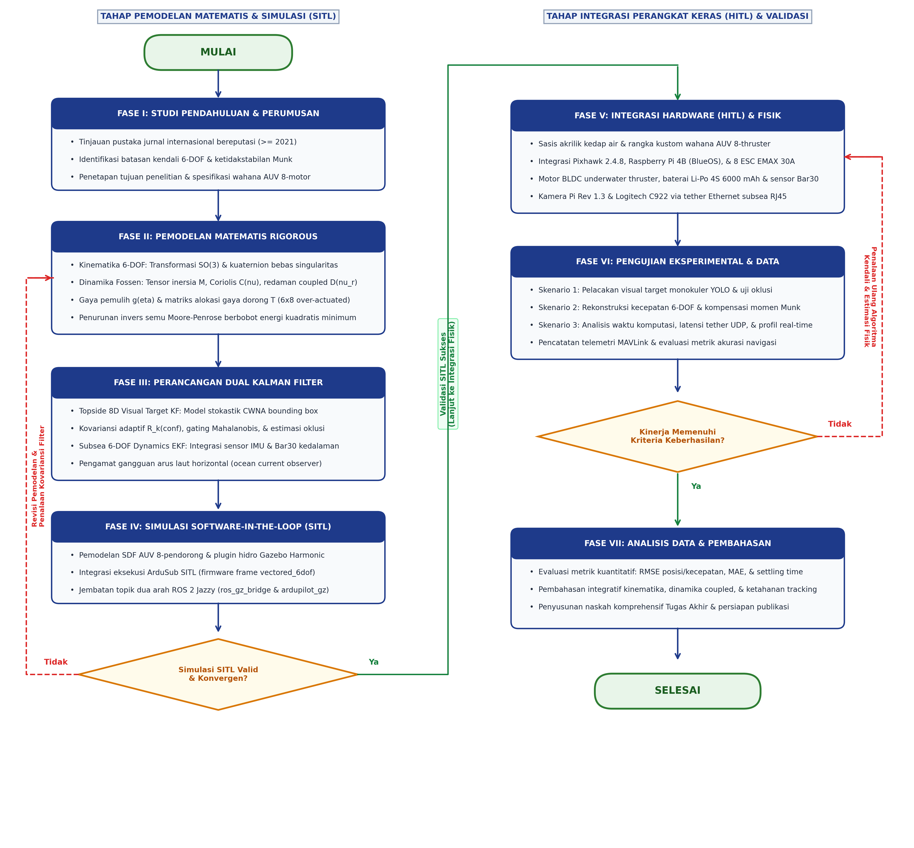
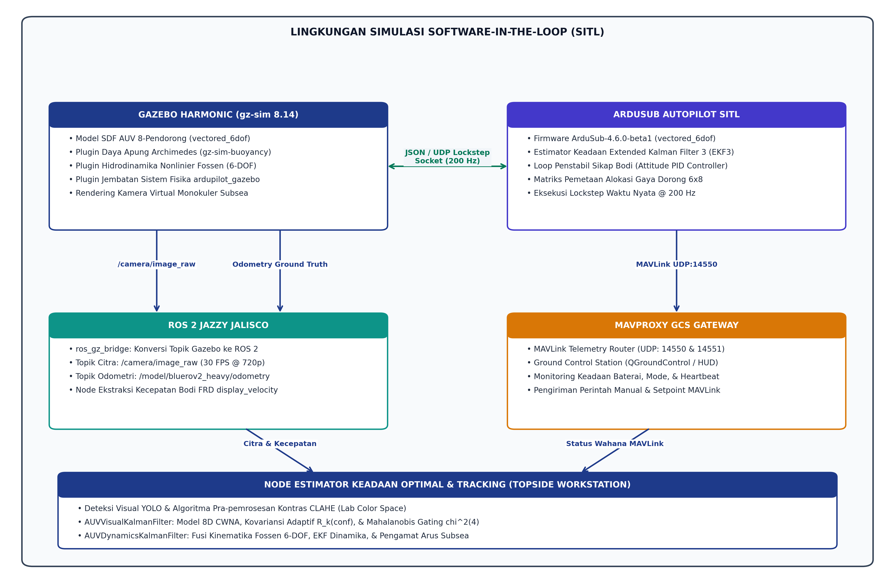
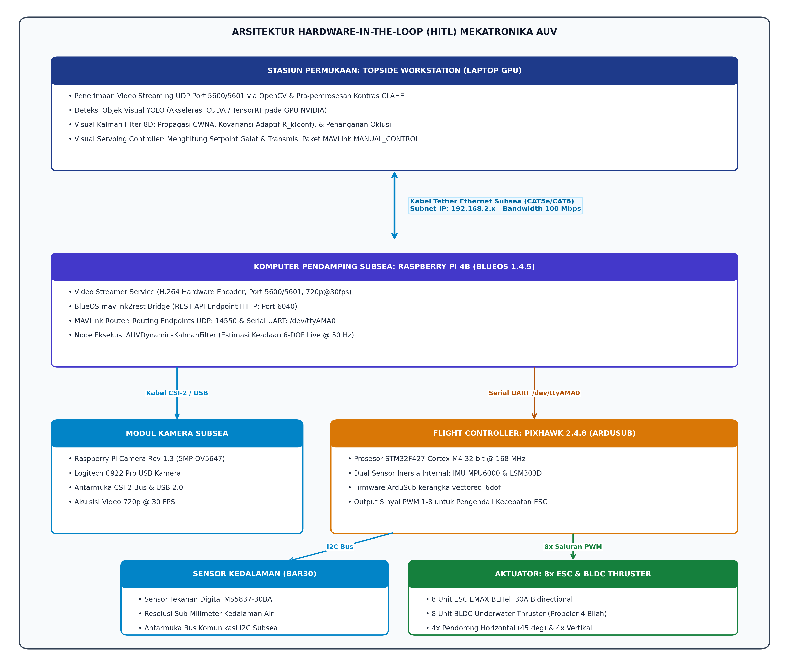
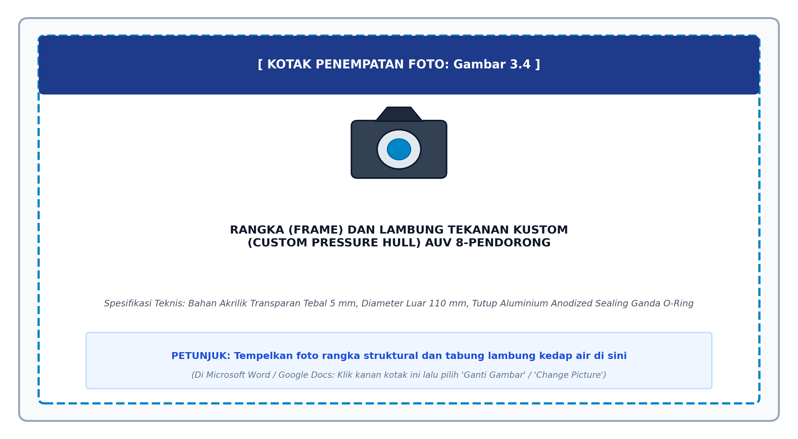
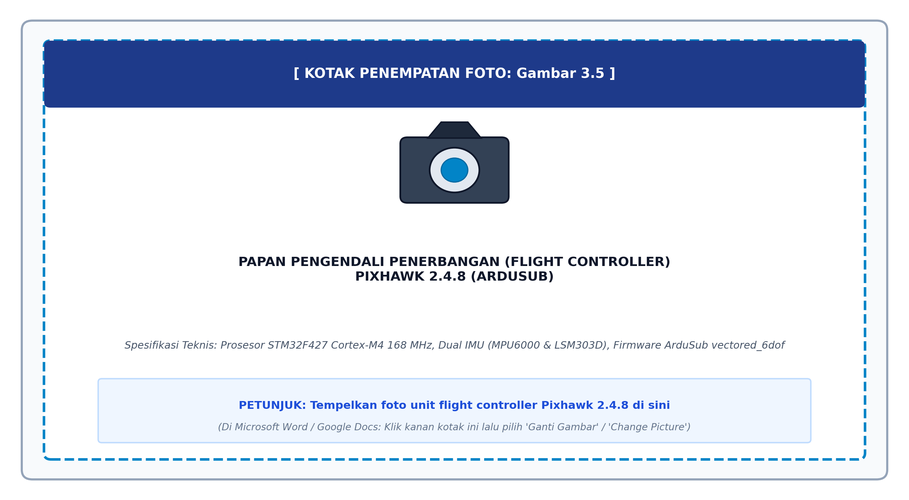
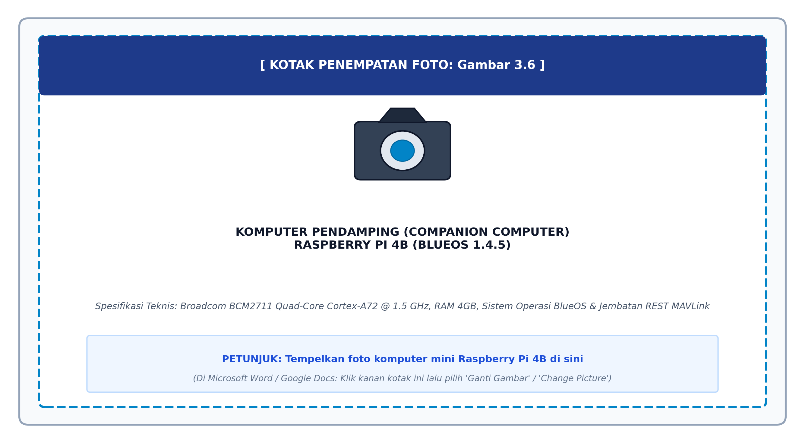
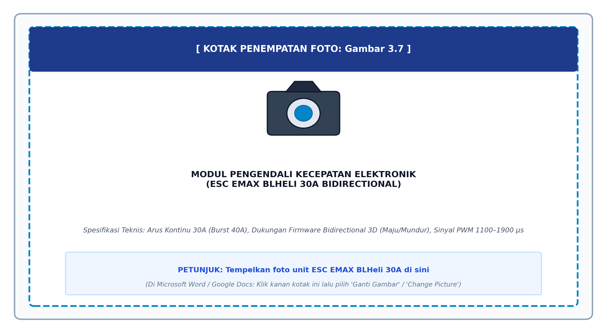
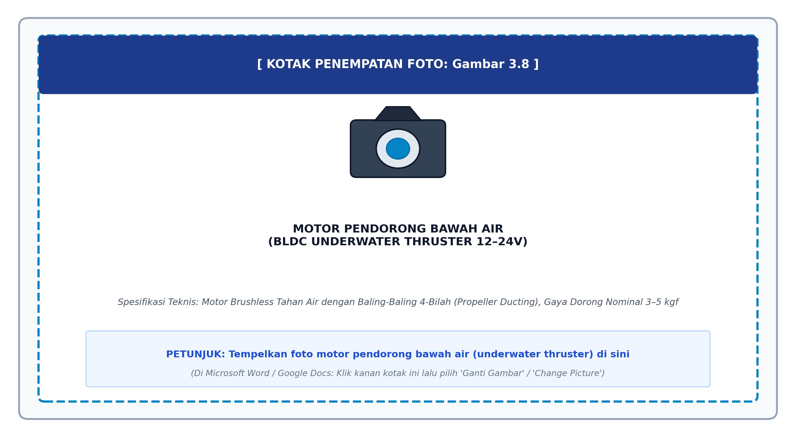
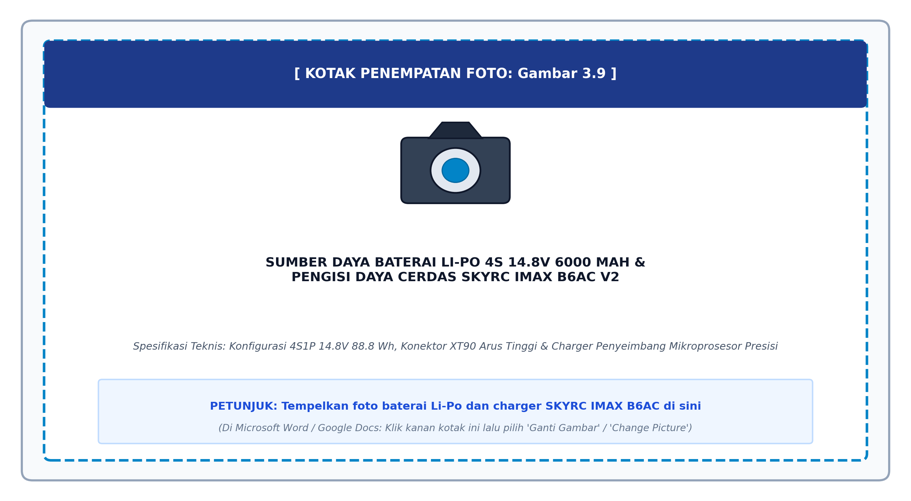

# BAB III. METODOLOGI PENELITIAN
## ANALISIS KINEMATIKA, DINAMIKA, DAN ESTIMASI KEADAAN OPTIMAL *KALMAN FILTER* UNTUK *VISION-BASED TRACKING* PADA *OVER-ACTUATED 8-THRUSTER 6-DOF VECTORED AUV

---

> Penulis: MUH. RADHI SYAFIQ GHANIM. S  
> NIM: D021201006  
> Departemen: Departemen Teknik Mesin, Fakultas Teknik, Universitas Hasanuddin  
> Format Penulisan: Sesuai dengan Pedoman Tugas Akhir Mahasiswa Sarjana (S1) Universitas Hasanuddin  
> Standar Notasi: Society of Naval Architects and Marine Engineers (SNAME, 1950) & Fossen (2021)  
> Format Matematis: Seluruh persamaan dan simbol variabel diformat menggunakan delimitasi `$$...$$` untuk Google Docs Auto-LaTeX Equations.

---

## 3.1 Tempat dan Waktu Penelitian

### 3.1.1 Tempat Pelaksanaan Penelitian
Penelitian tugas akhir mengenai perancangan, pemodelan matematis, simulasi numerik, dan pengujian sistem estimasi terpadu pada wahana kapal selam otonom (*Autonomous Underwater Vehicle* / AUV) 6 *Degrees of Freedom* (6-DOF) *over-actuated 8-pendorong ini dilaksanakan di:
1. *Laboratorium Mekatronika dan Robotika*, Departemen Teknik Mesin, Fakultas Teknik, Universitas Hasanuddin, Kampus Terpadu Fakultas Teknik Unhas, Gowa, Sulawesi Selatan. Fasilitas laboratorium digunakan untuk pengembangan modul komputasi tepi (companion computer* Raspberry Pi 4B), integrasi sensor inersia dan sensor tekanan subsea pada *flight controller* Pixhawk 2.4.8, perakitan kabel komunikasi *tether* Ethernet Fathom-X, serta pengujian *Hardware-In-The-Loop (HITL).
2. *Fasilitas Komputasi GPU dan Simulasi Topside*, digunakan untuk eksekusi simulasi lingkungan hidrodinamika virtual Software-In-The-Loop* (SITL) berbasis robotik Gazebo Harmonic dan ROS 2 Jazzy Jalisco, akselerasi jaringan syaraf tiruan *deep learning* YOLO26 / YOLO-World, serta komputasi penapis *8D Visual Target Kalman Filter.

### 3.1.2 Waktu Pelaksanaan Penelitian
Pelaksanaan penelitian tugas akhir ini dijadwalkan berlangsung selama kurun waktu enam bulan pada Tahun Akademik 2026/2027 (September 2026 hingga Februari 2027). Rincian tahapan pelaksanaan penelitian disusun ke dalam jadwal kerja bulanan sebagai berikut:
- Bulan 1 (September 2026): Studi literatur komprehensif, perumusan formulasi matematis kinematika dan dinamika 6-DOF, serta perancangan geometri kerangka wahana.
- Bulan 2 (Oktober 2026): Fabrikasi kerangka kustom (*custom frame*), perakitan tabung lambung silinder akrilik kedap air (*custom hull*), instalasi 8 motor pendorong BLDC, 8 unit ESC EMAX BLHeli 30A, dan kalibrasi sensor kedalaman MS5837.
- Bulan 3 (November 2026): Perancangan dan integrasi arsitektur komputasi perangkat keras *companion computer* Raspberry Pi 4B, *flight controller* Pixhawk 2.4.8 (ArduSub `vectored_6dof`), serta pengujian jalur *tether* Ethernet.
- Bulan 4 (Desember 2026): Pengembangan algoritma *Dual Kalman Filter* (*Topside Visual Kalman Filter* 8D pada laptop berakselerasi GPU NVIDIA dan *Subsea AUVDynamicsKalmanFilter* 6-DOF pada RPi 4B) serta simulasi *Software-In-The-Loop* (SITL) Gazebo Harmonic.
- Bulan 5 (Januari 2027): Pengujian eksperimental terpadu *Hardware-In-The-Loop* (HITL) di tangki uji perairan Laboratorium Mekatronika dan Robotika, evaluasi ketahanan pelacakan target visual (*tracking* YOLO), dan analisis penolakan gangguan arus laut.
- Bulan 6 (Februari 2027): Analisis data kuantitatif komprehensif, kalkulasi metrik evaluasi galat (RMSE dan MAE), penyusunan laporan naskah skripsi, dan penyelesaian administrasi tugas akhir.

### 3.1.3 Batasan dan Asumsi Penelitian
Untuk menjaga fokus analisis teknik mesin pada sistem wahana otonom dan memastikan ketercapaian target ilmiah, ditetapkan batasan dan asumsi penelitian sebagai berikut:
1. Model Wahana: Wahana yang diteliti menggunakan kerangka kustom dan lambung silinder akrilik (*custom-made AUV hull and frame*) untuk sistem *Over-Actuated 8-Thruster 6-DOF Vectored AUV*. Sistem propulsi terdiri atas 8 unit motor pendorong tanpa sikat bawah air (*BLDC underwater thrusters*) 12–24V yang dikonfigurasikan menjadi 4 pendorong horizontal bersudut vektor $$45^\circ$$ dan 4 pendorong vertikal independen pada empat sudut kerangka. Motor pendorong komersial ini dipilih karena ketersediaannya di pasar Indonesia, menggantikan motor Blue Robotics BLDC Underwater Thruster yang tidak tersedia di dalam negeri [3], [21].
2. *Karakteristik Fluida Kerja*: Media fluida diasumsikan sebagai fluida inkompresibel tak terbatas (unbounded incompressible fluid) homogen dengan densitas air tawar nominal $$\rho = 1000\text{ kg/m}^3$$ untuk uji laboratorium simulasi dan air laut nominal $$\rho = 1025\text{ kg/m}^3$$ untuk uji kondisi subsea penuh [5], [7].
3. *Rezim Kecepatan Operasi*: Kecepatan linier translasi wahana dibatasi pada rentang kecepatan rendah hingga sedang ($$|\boldsymbol{\nu}| \le 1.5\text{ m/s}$$), di mana gelombang permukaan dan efek batas dinding dapat diabaikan (deep-water assumption).
4. *Gangguan Arus Laut (*Ocean Currents)*: Arus laut dimodelkan sebagai aliran irasional dan konstan atau bervariasi lambat (*slowly-varying horizontal current) relatif terhadap waktu dalam kerangka bumi:
   $$\dot{\mathbf{V}}_c^n \approx \mathbf{0}$$
5. *Kondisi Optik Bawah Air*: Citra visual monokuler dari kamera diasumsikan mengalami degradasi kontras, penyerapan spektral, dan hamburan cahaya (scattering*) khas lingkungan perairan, yang dimitigasi secara komputasional melalui algoritma prapemrosesan *Contrast Limited Adaptive Histogram Equalization* (CLAHE) [2], [14].

---

## 3.2 Diagram Alir Penelitian

Metodologi penelitian ini dirancang dengan pendekatan rekayasa sistem mekatronika tertutup (*closed-loop mechatronic systems engineering*). Alur penelitian disusun ke dalam tujuh fase utama dan dua gerbang evaluasi keputusan (*decision gateways*) yang saling terhubung secara terstruktur, sebagaimana divisualisasikan pada diagram alir di bawah ini:



Gambar 3.1 Diagram alir tahapan penelitian komprehensif

### Penjelasan Rinci Setiap Tahapan Diagram Alir:
1. *Fase I (Studi Pendahuluan dan Perumusan Masalah)*: Mengidentifikasi keterbatasan mendasar pada wahana konvensional *underactuated* 6-pendorong, khususnya fenomena kopling silang momen Munk hidrodinamika yang mendestabilisasi gerak *yaw* dan ketidakmampuan manuver *pitch-hold* aktif [7], [6], [32], [40], [34]. Studi literatur dipusatkan pada publikasi mutakhir ($$\ge 2021$$) di bidang estimasi parameter hidrodinamika [1], penapis Bayesian [25], dan kendali wahana *over-actuated* [21], [32].
2. *Fase II (Pemodelan Matematis Rigorous)*: Menurunkan model analitis lengkap gerak wahana bawah air 6-DOF berdasarkan standar SNAME (1950) dan Fossen (2021) [7]. Formulasi meliputi transformasi rotasi $$SO(3)$$, perumusan kinematika kuaternion bebas *gimbal lock*, pemodelan tensor inersia total $$\mathbf{M}$$, tensor Coriolis $$\mathbf{C}(\boldsymbol{\nu})$$, tensor redaman non-linier $$\mathbf{D}(\boldsymbol{\nu}_r)$$, gaya apung/berat hidrostatis $$\mathbf{g}(\boldsymbol{\eta})$$, serta matriks geometri alokasi pendorong $$\mathbf{T}_{6 \times 8}$$ menggunakan invers semu Moore-Penrose [21], [32].
3. *Fase III (Perancangan Arsitektur Dual Kalman Filter)*: Merancang dua modul penapis optimal yang bekerja secara komplementer:
   - *Topside/Onboard Visual Target Kalman Filter* (`AUVVisualKalmanFilter`): Penapis linier diskrit 8-dimensi berbasis model percepatan derau putih kontinu (*Continuous White Noise Acceleration* / CWNA) dengan kovariansi adaptif berbobot skor konfidensi YOLO $$\mathbf{R}_k(\text{conf})$$, validasi jarak inovasi Mahalanobis $$\chi^2(4)$$, dan mekanisme propagasi *dead-reckoning* saat terjadi oklusi visual [16], [17], [25].
   - *Subsea Hydrodynamic Dynamics Extended Kalman Filter* (`AUVDynamicsKalmanFilter`): Penapis non-linier 6-DOF yang menggabungkan pembacaan sensor inersia Pixhawk dan sensor tekanan kedalaman dengan model kinetika Fossen, dilengkapi pengamat gangguan arus laut (*ocean current disturbance observer*) [7], [18], [29].
4. *Fase IV (Simulasi Software-In-The-Loop / SITL)*: Membangun lingkungan simulasi virtual presisi tinggi memanfaatkan simulator Gazebo Harmonic (`gz-sim 8.14`) dan *Robot Operating System* (ROS 2 Jazzy Jalisco) [14], [31]. Wahana AUV 8-pendorong dimodelkan dalam format *Simulation Description Format* (SDF) lengkap dengan *plugin* hidrodinamika dan daya apung. Sistem kendali dieksekusi melalui ArduSub SITL dengan model kerangka `vectored_6dof` yang berkomunikasi dua arah via protokol JSON/UDP [21].
- *Evaluasi Validasi SITL dan Konvergensi Filter (Decision Gateway 1)*: Merupakan gerbang pengujian pertama untuk memastikan bahwa model numerik dan penapis Kalman stabil sebelum diaplikasikan ke perangkat keras. Kriteria evaluasi mencakup kekonvergenan kovariansi galat $$\mathbf{P}_k$$, tidak adanya osilasi divergen pada alokasi gaya dorong, dan respon dinamika yang konsisten pada resolusi *step size* waktu nyata ($$\Delta t = 1\text{ ms}$$). Apabila kriteria tidak terpenuhi (*Tidak*), sistem memasuki *feedback loop* untuk merevisi parameter pemodelan fisik (Fase II) serta menala ulang kovariansi derau proses $$\mathbf{Q}$$ dan derau pengukuran $$\mathbf{R}$$ (Fase III). Jika simulasi valid dan konvergen (*Ya*), penelitian berlanjut ke integrasi fisik.
5. *Fase V (Integrasi Hardware-In-The-Loop / HITL dan Fabrikasi Fisik)*: Mengintegrasikan perangkat keras fisik wahana ke dalam lingkungan komputasi permukaan melalui kabel *tether* Ethernet subsea [2], [14]. Komponen fisik mencakup sasis akrilik kedap air (*custom pressure hull*), *flight controller* Pixhawk 2.4.8 (menjalankan ArduSub), *companion computer* Raspberry Pi 4B (menjalankan BlueOS), 8 unit ESC EMAX BLHeli 30A, 8 motor BLDC *underwater thruster*, baterai Li-Po 4S 6000 mAh, sensor tekanan digital Bar30 MS5837, serta kamera Raspberry Pi Rev 1.3 dan Logitech C922. Stasiun permukaan memproses deteksi objek YOLO dan mengeksekusi penapis visual 8D, lalu mengirimkan *setpoint* kendali *visual servoing* kembali ke wahana melalui MAVLink.
6. *Fase VI (Pengujian Eksperimental, Validasi, dan Akuisisi Data)*: Menjalankan serangkaian eksperimen terukur untuk mengevaluasi akurasi pelacakan visual target monokuler, kemampuan penapisan derau frekuensi tinggi, ketahanan terhadap oklusi target temporer, akurasi rekonstruksi kecepatan bodi 6-DOF, mitigasi momen Munk, serta latensi komputasi waktu nyata (*real-time execution profiling*).
- *Evaluasi Kinerja Eksperimental (Decision Gateway 2)*: Merupakan gerbang keputusan kedua terhadap data hasil uji eksperimental fisik. Kriteria keberhasilan dinilai berdasarkan: (a) *Root Mean Square Error* (RMSE) pelacakan posisi dan estimasi kecepatan yang rendah, (b) kestabilan orientasi wahana (minim osilasi pada *pitch* dan *yaw* akibat kopling momen Munk), serta (c) *throughput* pemrosesan visual mencapai batas waktu nyata ($$\ge 30\text{ FPS}$$ dengan latensi $$\le 40\text{ ms}$$). Apabila kriteria tidak terpenuhi (*Tidak*), sistem memasuki *feedback loop* untuk melakukan penalaan ulang pada algoritma kendali MAVLink dan estimator fisik (kembali ke Fase V dan Fase III). Jika seluruh target kinerja tercapai (*Ya*), penelitian berlanjut ke analisis akhir.
7. *Fase VII (Analisis Data Komprehensif, Pembahasan, dan Kesimpulan)*: Melakukan analisis kuantitatif mendalam terhadap seluruh metrik evaluasi eksperimen (RMSE, MAE, TSR, *settling time*), mensintesis interaksi antara pemodelan dinamika 6-DOF dan estimasi keadaan penapis Kalman, menyusun simpulan terpadu, serta merumuskan laporan akhir naskah proposal/skripsi dan manuskrip publikasi ilmiah.

---

## 3.3 Identifikasi Parameter Fisik dan Hidrodinamika Wahana

Keberhasilan perancangan penapis Kalman dinamika (*AUVDynamicsKalmanFilter) dan alokasi gaya dorong *over-actuated* bergantung mutlak pada akurasi parameter fisik dan koefisien hidrodinamika wahana. Sub-bab ini merangkum identifikasi numerik dari parameter benda tegar (*rigid-body*), massa tambah hidrodinamika (*added mass*), redaman fluida (*hydrodynamic damping*), gaya pemulih hidrostatis (*restoring forces*), serta geometri alokasi pendorong 8-motor BlueROV2 Heavy [1], [3], [7], [34].

### 3.3.1 Parameter Fisik dan Properti Benda Tegar (Rigid-Body Properties*)
Wahana yang digunakan adalah konfigurasi *retrofit* BlueROV2 Heavy berbahan dasar tabung akrilik tahan tekanan tinggi dengan rangka struktural *High-Density Polyethylene (HDPE) [3]. Parameter massa total, dimensi fisik, dan posisi pusat massa/apung ditabulasikan pada Tabel 3.1.

Tabel 3.1 Parameter Fisik dan Properti Benda Tegar Wahana Over-Actuated 8-Pendorong
| Parameter Fisis | Simbol Matematis | Nilai Numerik | Satuan SI | Sumber / Metode Penentuan |
|---|---|---|---|---|
| Massa Total Wahana | $$m$$ | $$13.00$$ | $$\text{kg}$$ | Pengukuran timbangan digital presisi [3] |
| Panjang Total (*Length*) | $$L$$ | $$0.457$$ | $$\text{m}$$ | Pengukuran fisik geometri kerangka |
| Lebar Total (*Beam/Width*) | $$W$$ | $$0.338$$ | $$\text{m}$$ | Pengukuran fisik geometri kerangka |
| Tinggi Total (*Height*) | $$H$$ | $$0.254$$ | $$\text{m}$$ | Pengukuran fisik geometri kerangka |
| Volume Benaman Total | $$\nabla$$ | $$0.0132$$ | $$\text{m}^3$$ | Analisis model CAD 3D & hukum Archimedes |
| Posisi Pusat Apung (CB) | $$\mathbf{r}_b = [x_b, y_b, z_b]^T$$ | $$[0.00, 0.00, 0.00]^T$$ | $$\text{m}$$ | Ditetapkan sebagai titik asal bodi ($$O_b$$) [7] |
| Posisi Pusat Gravitasi (CG) | $$\mathbf{r}_g = [x_g, y_g, z_g]^T$$ | $$[0.00, 0.00, 0.02]^T$$ | $$\text{m}$$ | Analisis distribusi massa ballast bawah [3], [31] |
| Momen Inersia Roll Benda Tegar | $$I_{xx}$$ | $$0.160$$ | $$\text{kg}\cdot\text{m}^2$$ | Analisis CAD & estimasi semi-empiris [31] |
| Momen Inersia Pitch Benda Tegar | $$I_{yy}$$ | $$0.240$$ | $$\text{kg}\cdot\text{m}^2$$ | Analisis CAD & estimasi semi-empiris [31] |
| Momen Inersia Yaw Benda Tegar | $$I_{zz}$$ | $$0.280$$ | $$\text{kg}\cdot\text{m}^2$$ | Analisis CAD & estimasi semi-empiris [31] |
| Densitas Air Tawar Uji | $$\rho_{\text{fresh}}$$ | $$1000.0$$ | $$\text{kg/m}^3$$ | Standar kondisi fluida laboratorium |
| Densitas Air Laut Nominal | $$\rho_{\text{salt}}$$ | $$1025.0$$ | $$\text{kg/m}^3$$ | Standar oseanografi subsea DNV (2021) [5] |
| Percepatan Gravitasi Lokal | $$g$$ | $$9.80665$$ | $$\text{m/s}^2$$ | Standar gravitasi bumi internasional |

Berdasarkan nilai pada Tabel 3.1, gaya berat total wahana dihitung melalui persamaan:
$$W = m g = 13.00 \times 9.80665 = 127.486\text{ N}$$

Gaya apung total (*buoyancy force*) pada air tawar dan air laut adalah:
$$B_{\text{fresh}} = \rho_{\text{fresh}} g \nabla = 1000.0 \times 9.80665 \times 0.0132 = 129.448\text{ N}$$
$$B_{\text{salt}} = \rho_{\text{salt}} g \nabla = 1025.0 \times 9.80665 \times 0.0132 = 132.684\text{ N}$$

Selisih gaya hidrostatis neto ($$B - W$$) menghasilkan daya apung positif (*positive buoyancy*) yang terukur sebesar $$+1.962\text{ N}$$ (pada air tawar) dan $$+5.198\text{ N}$$ (pada air laut). Karakteristik *positive buoyancy* ini merupakan persyaratan keselamatan esensial pada robotika bawah air (*fail-safe design), sehingga wahana akan mengapung secara pasif ke permukaan apabila terjadi kegagalan daya baterai total [3], [7].

Karena pusat massa ($$z_g = +0.02\text{ m}$$) terletak di bawah pusat apung ($$z_b = 0.00\text{ m}$$), jarak metasentrik vertikal bernilai positif ($$\overline{BG} = z_g - z_b = +0.02\text{ m}$$), yang memberikan stabilitas statis pasif inheren pada sumbu *Roll* ($$\phi$$) dan *Pitch* ($$\theta$$) [7].

Matriks inersia benda tegar $$\mathbf{M}_{RB} \in \mathbb{R}^{6 \times 6}$$ dihitung menggunakan formulasi Fossen:
$$\mathbf{M}_{RB} = \begin{bmatrix} 
m\mathbf{I}_{3 \times 3} & -m\mathbf{S}(\mathbf{r}_g) \ 
m\mathbf{S}(\mathbf{r}_g) & \mathbf{I}_b 
\end{bmatrix} = \begin{bmatrix} 
13.00 & 0 & 0 & 0 & 0.26 & 0 \ 
0 & 13.00 & 0 & -0.26 & 0 & 0 \ 
0 & 0 & 13.00 & 0 & 0 & 0 \ 
0 & -0.26 & 0 & 0.1652 & 0 & 0 \ 
0.26 & 0 & 0 & 0 & 0.2452 & 0 \ 
0 & 0 & 0 & 0 & 0 & 0.2800 
\end{bmatrix}$$

### 3.3.2 Estimasi Derivatif Massa Tambah Hidrodinamika (Hydrodynamic Added Mass*)
Massa tambah hidrodinamika timbul akibat percepatan massa fluida di sekitar lambung wahana ketika wahana bergerak [1], [7], [34]. Mengingat wahana beroperasi pada kecepatan jelajah moderat dan memiliki bidang simetri ganda (bidang *port-starboard* dan *fore-aft* mendekati simetris), suku-suku kopling silang di luar diagonal bernilai sangat kecil dibandingkan suku diagonal utamanya [31], [34]. Derivatif massa tambah hidrodinamika ditentukan berdasarkan hasil identifikasi eksperimental PMM dan analisis komputasi fluida (CFD) yang telah divalidasi oleh pengujian eksperimental *Planar Motion Mechanism (PMM) dan survei literatur wahana kelas BlueROV2 [1], [4], [7], [12], [26], [28], [31], [34], [37]:

$$\mathbf{M}_A = -\text{diag}\left( X_{\dot{u}}, Y_{\dot{v}}, Z_{\dot{w}}, K_{\dot{p}}, M_{\dot{q}}, N_{\dot{r}}  \right)$$

Nilai numerik massa tambah hidrodinamika dirangkum pada Tabel 3.2.

Tabel 3.2 Koefisien Derivatif Massa Tambah Hidrodinamika Wahana
| Derajat Kebebasan (DOF) | Koefisien Notasi SNAME | Nilai Numerik | Satuan SI | Interpretasi Fisis Fluida |
|---|---|---|---|---|
| Massa Tambah Surge | $$X_{\dot{u}}$$ | $$-5.50$$ | $$\text{kg}$$ | Fluida terakselerasi penampang frontal ramping |
| Massa Tambah Sway | $$Y_{\dot{v}}$$ | $$-12.70$$ | $$\text{kg}$$ | Fluida terakselerasi penampang samping tabung ganda |
| Massa Tambah Heave | $$Z_{\dot{w}}$$ | $$-14.60$$ | $$\text{kg}$$ | Fluida terakselerasi penampang datar atas/bawah |
| Momen Tambah Roll | $$K_{\dot{p}}$$ | $$-0.12$$ | $$\text{kg}\cdot\text{m}^2$$ | Kelembaman rotasi fluida mengelilingi sumbu longitudinal |
| Momen Tambah Pitch | $$M_{\dot{q}}$$ | $$-0.25$$ | $$\text{kg}\cdot\text{m}^2$$ | Kelembaman rotasi fluida mengelilingi sumbu transversal |
| Momen Tambah Yaw | $$N_{\dot{r}}$$ | $$-0.27$$ | $$\text{kg}\cdot\text{m}^2$$ | Kelembaman rotasi fluida mengelilingi sumbu vertikal |

Dari Tabel 3.2, tampak bukti kuantitatif asimetri massa tambah transversal dan longitudinal:
$$|Y_{\dot{v}}| = 12.70\text{ kg} > |X_{\dot{u}}| = 5.50\text{ kg}$$

Selisih koefisien ini menghasilkan parameter momen Munk hidrodinamika yang sangat signifikan [7], [34]:
$$X_{\dot{u}} - Y_{\dot{v}} = -5.50 - (-12.70) = +7.20\text{ kg} > 0$$

Nilai positif $$+7.20\text{ kg}$$ ini secara analitis membuktikan bahwa setiap gangguan arus samping atau kecepatan gerak *sway* ($$v_r > 0$$) saat wahana melaju ke depan ($$u_r > 0$$) akan menghasilkan momen putar *yaw* destabilisasi sebesar:
$$N_{\text{Munk}} = +7.20 \, u_r v_r \quad (\text{N}\cdot\text{m})$$
yang harus diredam secara aktif oleh sistem kendali alokasi pendorong 8-motor [21], [32].

Matriks massa total wahana $$\mathbf{M} = \mathbf{M}_{RB} + \mathbf{M}_A$$ adalah:
$$\mathbf{M} = \begin{bmatrix} 
18.50 & 0 & 0 & 0 & 0.26 & 0 \ 
0 & 25.70 & 0 & -0.26 & 0 & 0 \ 
0 & 0 & 27.60 & 0 & 0 & 0 \ 
0 & -0.26 & 0 & 0.2852 & 0 & 0 \ 
0.26 & 0 & 0 & 0 & 0.4952 & 0 \ 
0 & 0 & 0 & 0 & 0 & 0.5500 
\end{bmatrix}$$

### 3.3.3 Matriks Koefisien Redaman Hidrodinamika Fluida
Gaya hambat hidrodinamika fluida dimodelkan sebagai superposisi antara redaman gesek linier Navier-Stokes ($$\mathbf{D}_L$$) untuk aliran laminer kecepatan rendah dan redaman bentuk kuadratik non-linier (quadratic form drag* $$\mathbf{D}_{NL}$$) akibat pusaran turbulen (*vortex shedding) di sekitar struktur kerangka terbuka [7], [31], [34]:

$$\mathbf{D}(\boldsymbol{\nu}_r) = \mathbf{D}_L + \mathbf{D}_{NL}(\boldsymbol{\nu}_r)$$

di mana matriks linier dan matriks kuadratik diagonal didefinisikan sebagai:
$$\mathbf{D}_L = -\text{diag}\left( X_u, Y_v, Z_w, K_p, M_q, N_r  \right)$$
$$\mathbf{D}_{NL}(\boldsymbol{\nu}_r) = -\text{diag}\left( X_{u|u|}|u_r|, Y_{v|v|}|v_r|, Z_{w|w|}|w_r|, K_{p|p|}|p|, M_{q|q|}|q|, N_{r|r|}|r|  \right)$$

Nilai-nilai koefisien redaman yang digunakan dalam penelitian ini disajikan pada Tabel 3.3 [31], [34].

Tabel 3.3 Koefisien Redaman Hidrodinamika Linier dan Kuadratik Wahana
| Sumbu Gerak | Koefisien Linier | Nilai ($$\text{SI}$$) | Koefisien Kuadratik | Nilai ($$\text{SI}$$) |
|---|---|---|---|---|
| Surge ($$u$$) | $$X_u$$ | $$-4.03\text{ N}\cdot\text{s/m}$$ | $$X_{u|u|}$$ | $$-18.18\text{ N}\cdot\text{s}^2/\text{m}^2$$ |
| Sway ($$v$$) | $$Y_v$$ | $$-6.22\text{ N}\cdot\text{s/m}$$ | $$Y_{v|v|}$$ | $$-21.66\text{ N}\cdot\text{s}^2/\text{m}^2$$ |
| Heave ($$w$$) | $$Z_w$$ | $$-5.18\text{ N}\cdot\text{s/m}$$ | $$Z_{w|w|}$$ | $$-36.99\text{ N}\cdot\text{s}^2/\text{m}^2$$ |
| Roll ($$p$$) | $$K_p$$ | $$-0.07\text{ N}\cdot\text{m}\cdot\text{s/rad}$$ | $$K_{p|p|}$$ | $$-1.55\text{ N}\cdot\text{m}\cdot\text{s}^2/\text{rad}^2$$ |
| Pitch ($$q$$) | $$M_q$$ | $$-0.07\text{ N}\cdot\text{m}\cdot\text{s/rad}$$ | $$M_{q|q|}$$ | $$-1.55\text{ N}\cdot\text{m}\cdot\text{s}^2/\text{rad}^2$$ |
| Yaw ($$r$$) | $$N_r$$ | $$-0.07\text{ N}\cdot\text{m}\cdot\text{s/rad}$$ | $$N_{r|r|}$$ | $$-1.55\text{ N}\cdot\text{m}\cdot\text{s}^2/\text{rad}^2$$ |

### 3.3.4 Konfigurasi Geometri dan Matriks Alokasi Pendorong 8-Motor ($$\mathbf{T}_{6 \times 8}$$)
Konfigurasi pendorong pada BlueROV2 Heavy terdiri dari delapan motor pendorong BLDC bawah air [3], [21]:
1. *Pendorong Horizontal 1–4*: Dipasang pada bidang horizontal ($$xy$$) dengan sudut kemiringan $$\pm 45^\circ$$ ($$\pi/4\text{ rad}$$) terhadap sumbu longitudinal. Konfigurasi vektor ini menghasilkan gaya dorong terkopling pada sumbu *Surge*, *Sway*, dan torsi *Yaw*.
2. *Pendorong Vertikal 5–8*: Dipasang tegak lurus searah sumbu $$z$$ pada empat sudut terluar kerangka. Konfigurasi ini menghasilkan gaya dorong murni pada sumbu *Heave*, serta torsi diferensial pada sumbu *Roll* dan *Pitch*.

Koordinat posisi pendorong $$\mathbf{r}_i = [x_i, y_i, z_i]^T$$ relatif terhadap titik asal bodi ($$O_b$$) dan vektor arah dorong satuan $$\mathbf{d}_i$$ ditabulasikan pada Tabel 3.4.

Tabel 3.4 Posisi Spasial dan Vektor Satuan Gaya Dorong 8-Pendorong Bervektor
| No. Pendorong | Posisi $$x_i\text{ (m)}$$ | Posisi $$y_i\text{ (m)}$$ | Posisi $$z_i\text{ (m)}$$ | Vektor Arah Gaya Dorong $$\mathbf{d}_i$$ | Aksi Sumbu Utama |
|---|---|---|---|---|---|
| Pendorong 1 (Depan-Kanan) | $$+0.156$$ | $$+0.111$$ | $$0.000$$ | $$[\cos 45^\circ, -\sin 45^\circ, 0]^T$$ | Surge (+), Sway (-), Yaw (-) |
| Pendorong 2 (Depan-Kiri) | $$+0.156$$ | $$-0.111$$ | $$0.000$$ | $$[\cos 45^\circ, \sin 45^\circ, 0]^T$$ | Surge (+), Sway (+), Yaw (+) |
| Pendorong 3 (Belakang-Kanan) | $$-0.156$$ | $$+0.111$$ | $$0.000$$ | $$[-\cos 45^\circ, -\sin 45^\circ, 0]^T$$ | Surge (-), Sway (-), Yaw (+) |
| Pendorong 4 (Belakang-Kiri) | $$-0.156$$ | $$-0.111$$ | $$0.000$$ | $$[-\cos 45^\circ, \sin 45^\circ, 0]^T$$ | Surge (-), Sway (+), Yaw (-) |
| Pendorong 5 (Vertikal Depan-Kanan) | $$+0.120$$ | $$+0.218$$ | $$-0.075$$ | $$[0, 0, 1]^T$$ | Heave (+), Roll (-), Pitch (+) |
| Pendorong 6 (Vertikal Depan-Kiri) | $$+0.120$$ | $$-0.218$$ | $$-0.075$$ | $$[0, 0, 1]^T$$ | Heave (+), Roll (+), Pitch (+) |
| Pendorong 7 (Vertikal Belakang-Kanan)| $$-0.120$$ | $$+0.218$$ | $$-0.075$$ | $$[0, 0, 1]^T$$ | Heave (+), Roll (-), Pitch (-) |
| Pendorong 8 (Vertikal Belakang-Kiri) | $$-0.120$$ | $$-0.218$$ | $$-0.075$$ | $$[0, 0, 1]^T$$ | Heave (+), Roll (+), Pitch (-) |

Dengan konstanta arah horizontal $$c = \cos(45^\circ) = \sin(45^\circ) = \frac{\sqrt{2}}{2} \approx 0.7071$$, kolom ke-$$i$$ dari matriks konfigurasi pendorong $$\mathbf{T}_{6 \times 8}$$ dibentuk melalui hubungan momen gaya:
$$\mathbf{t}_i = \begin{bmatrix} \mathbf{d}_i \ \mathbf{r}_i \times \mathbf{d}_i \end{bmatrix} \in \mathbb{R}^6$$

Perhitungan perkalian silang lengan torsi menghasilkan matriks konfigurasi numerik eksak $$\mathbf{T}_{6 \times 8} \in \mathbb{R}^{6 \times 8}$$:
$$\mathbf{T}_{6 \times 8} = \begin{bmatrix} 
0.7071 & 0.7071 & -0.7071 & -0.7071 & 0.0000 & 0.0000 & 0.0000 & 0.0000 \ 
-0.7071 & 0.7071 & -0.7071 & 0.7071 & 0.0000 & 0.0000 & 0.0000 & 0.0000 \ 
0.0000 & 0.0000 & 0.0000 & 0.0000 & 1.0000 & 1.0000 & 1.0000 & 1.0000 \ 
0.0000 & 0.0000 & 0.0000 & 0.0000 & 0.2180 & -0.2180 & 0.2180 & -0.2180 \ 
0.0000 & 0.0000 & 0.0000 & 0.0000 & -0.1200 & -0.1200 & 0.1200 & 0.1200 \ 
-0.1888 & 0.1888 & 0.1888 & -0.1888 & 0.0000 & 0.0000 & 0.0000 & 0.0000 
\end{bmatrix}$$

di mana baris ke-6 (sumbu *Yaw*) diperoleh dari:
$$\tau_{N,1} = x_1 d_{y,1} - y_1 d_{x,1} = (0.156)(-0.7071) - (0.111)(0.7071) = -0.1103 - 0.0785 = -0.1888\text{ m}$$

Karena jumlah aktuator ($$m = 8$$) melebihi jumlah derajat kebebasan gerak ($$n = 6$$), sistem ini bersifat *over-actuated* dengan derajat redundansi $$m - n = 2$$ [21], [32]. Solusi vektor gaya dorong individual pendorong $$\mathbf{f} = [f_1, f_2, \dots, f_8]^T \in \mathbb{R}^8$$ yang meminimalkan kriteria energi kuadratik total dihitung secara seketika (*real-time*) melalui operator invers semu Moore-Penrose:
$$\mathbf{f} = \mathbf{T}_{6 \times 8}^\dagger \boldsymbol{\tau} = \mathbf{T}_{6 \times 8}^T \left( \mathbf{T}_{6 \times 8} \mathbf{T}_{6 \times 8}^T  \right)^{-1} \boldsymbol{\tau}$$

Setiap komponen gaya dorong $$f_i\text{ (N)}$$ kemudian dipetakan ke sinyal lebar pulsa servo aktuator PWM ($$1100 - 1900\text{ }\mu\text{s}$$) dengan zona mati (deadband) nominal $$1475 - 1525\text{ }\mu\text{s}$$ sesuai karakteristik elektro-hidrodinamika ESC motor pendorong BLDC bawah air [3]:
$$\text{PWM}_i = \begin{cases} 
1500 & \text{jika } |f_i| < f_{\text{thresh}} \ 
1525 + \left( \frac{f_i}{f_{\max}}  \right) \times 375 & \text{jika } f_i \ge f_{\text{thresh}} \ 
1475 + \left( \frac{f_i}{f_{\max}}  \right) \times 375 & \text{jika } f_i \le -f_{\text{thresh}} 
\end{cases}$$
dengan batas gaya dorong maksimum $$f_{\max} = 35.0\text{ N}$$ pada tegangan suplai nominal $$16.0\text{ V}$$ [3].

---

## 3.4 Perancangan Arsitektur Software-In-The-Loop (SITL)

Arsitektur *Software-In-The-Loop* (SITL) dibangun untuk memvalidasi algoritma estimasi *Dual Kalman Filter dan kinematika/dinamika 6-DOF secara komprehensif di lingkungan simulasi hidrodinamika virtual sebelum diimplementasikan pada perangkat keras fisik, sejalan dengan metodologi *simulation-driven dan validasi *digital twin* yang dirumuskan oleh Karras dkk. (2024) serta Mari dkk. (2026) [14], [15], [19], [21], [31].



*Gambar 3.2* Arsitektur simulasi *software-in-the-loop* (SITL) sistem AUV

### 3.4.1 Lingkungan Simulasi Gazebo Harmonic (`gz-sim 8.14`)
Simulasi fisik wahana dijalankan pada Gazebo Harmonic (`gz-sim` versi 8.14) di bawah sistem operasi Ubuntu 24.04.4 LTS (Noble Numbat) [31]. Wahana BlueROV2 Heavy direpresentasikan dalam berkas deskripsi robotik Simulation Description Format* (SDF) yang mendefinisikan geometri visual, geometri tumbukan (*collision mesh), properti inersia, serta plugin fisika fluida:
1. *Plugin Daya Apung (`gz-sim-buoyancy-system`)*: Menghitung gaya angkat hidrostatis Archimedes secara terdistribusi berdasarkan volume elemen wahana yang tercelup fluida dan gradien tekanan kedalaman [31].
2. *Plugin Hidrodinamika (`gz-sim-hydrodynamics-system`)*: Mengimplementasikan model persamaan gerak Fossen (2021) secara langsung di dalam inti mesin fisika (physics engine) Gazebo [7]. Parameter massa tambah ($$X_{\dot{u}}, Y_{\dot{v}}, Z_{\dot{w}}, K_{\dot{p}}, M_{\dot{q}}, N_{\dot{r}}$$) dan koefisien redaman hidrodinamika linier serta kuadratik ($$X_u, X_{u|u|}, Y_v, Y_{v|v|}, \dots$$) dimasukkan sesuai hasil identifikasi pada Sub-bab 3.3.
3. *Plugin `ardupilot_gazebo`*: Bertindak sebagai jembatan komunikasi antara model fisik Gazebo dan perangkat lunak autopilot ArduSub [21]. Plugin ini membaca kecepatan putar motor pendorong dari paket JSON ArduSub, menerapkannya sebagai vektor gaya dorong pada model wahana di Gazebo, membaca kembali data sensor virtual (IMU, barometer tekanan kedalaman), dan mengirimkannya kembali ke ArduSub dengan sinkronisasi waktu langkah (lockstep simulation*) pada frekuensi $$200\text{ Hz}$$.

Dunia virtual bawah laut dimodelkan dalam berkas `bluerov2_heavy_underwater.world`, yang memuat media air tawar tenang dengan pencahayaan tereduksi, objek target visual geometris di dasar perairan, serta model gangguan arus laut horizontal konstan maupun dinamis.

### 3.4.2 Autopilot ArduSub SITL (`vectored_6dof`)
Perangkat lunak autopilot ArduSub (versi `ArduSub-4.6.0-beta1`) dikompilasi secara lokal dan dieksekusi menggunakan utilitas pembantu `sim_vehicle.py`:
```bash
python3 ~/auv_ws/firmware/ardupilot/Tools/autotest/sim_vehicle.py   -v ArduSub -f vectored_6dof --model JSON -w --console   --out udp:127.0.0.1:14550 --out udp:192.168.2.1:14550
```
Parameter `-f vectored_6dof` secara khusus mengonfigurasi ArduSub untuk menggunakan kerangka alokasi 8-pendorong dengan kendali aktif 6 derajat kebebasan penuh [21]. ArduSub SITL menjalankan estimator navigasi internal EKF3, loop kendali PID untuk penstabilan sudut orientasi (*attitude controller*), dan matriks alokasi pendorong untuk menghasilkan sinyal kendali motor pendorong.

### 3.4.3 Jembatan Komunikasi ROS 2 (`ros_gz_bridge`)
Untuk memfasilitasi pertukaran data antara simulator Gazebo Harmonic dan ekosistem komputasi robotika, diimplementasikan jembatan komunikasi *ros_gz_bridge pada distribusi ROS 2 Jazzy Jalisco [14]:
1. Topik data odometri wahana `/model/bluerov2_heavy/odometry` dijembatani menjadi pesan ROS 2 `nav_msgs/msg/Odometry` untuk merekam koordinat posisi $$(x, y, z)$$, orientasi kuaternion, dan kecepatan linier/sudut wahana sebagai nilai kebenaran dasar (*ground truth*).
2. Topik kamera virtual bawah air `/camera/image_raw` dijembatani menjadi pesan ROS 2 `sensor_msgs/msg/Image` dengan laju penyegaran $$30\text{ FPS}$$ pada resolusi $$1280 \times 720$$ piksel.
3. Node pembaca kecepatan `display_velocity.py` mengekstraksi kecepatan bodi relatif wahana secara *real-time* untuk memvalidasi estimasi kecepatan dari penapis dinamika EKF.

---

## 3.5 Perancangan Arsitektur Hardware-In-The-Loop (HITL)

Arsitektur *Hardware-In-The-Loop* (HITL) menggabungkan komponen perangkat keras fisik wahana (*flight controller* Pixhawk 2.4.8, *companion computer* Raspberry Pi 4B, modul kamera monokuler, dan sensor kedalaman Bar30 MS5837) dengan workstation permukaan berakselerasi GPU dalam sebuah loop kendali tertutup waktu nyata melalui jaringan tether Ethernet, mengadopsi prinsip arsitektur modular terdistribusi dan pemodelan dinamika kabel tether [2], [8], [9], [11], [14], [20], [30], [35], [36], [41].



*Gambar 3.3* Arsitektur integrasi *hardware-in-the-loop* (HITL) mekatronika AUV

### 3.5.1 Komponen Perangkat Keras dan Interkoneksi Fisik
Spesifikasi perangkat keras mekatronika yang diintegrasikan dalam arsitektur HITL dirangkum pada Tabel 3.5.

Tabel 3.5 Spesifikasi Komponen Perangkat Keras Arsitektur HITL
| Modul Sistem | Komponen Spesifik | Antarmuka / Protokol | Fungsi Utama dalam Sistem |
|---|---|---|---|
| Rangka & Lambung | Custom-made AUV Hull & Frame (Tabung Akrilik Silinder Kedap Air + Kerangka 8 Pendorong) | Mekanikal / Sealing O-Ring Ganda | Struktur fisik penahan tekanan hidrostatis dan dudukan geometris 8 pendorong bervektor |
| Flight Controller | Pixhawk 2.4.8 (STM32F427 Cortex-M4, 168 MHz) | UART Serial (`/dev/ttyAMA0`, 921600 baud) | Eksekusi ArduSub `vectored_6dof`, akuisisi IMU internal, loop kendali sikap, alokasi 8 pendorong [14] |
| Companion Computer | Raspberry Pi 4B (Quad-core Cortex-A72 @ 1.5 GHz, 4GB RAM) | Ethernet 10/100/1000 Mbps | Menjalankan sistem operasi BlueOS, kompresi video H.264, jembatan REST telemetri `mavlink2rest` |
| Sensor Kedalaman | Sensor Tekanan & Kedalaman Digital Subsea MS5837-30BA | I2C Bus (Alamat `0x76`) | Pengukuran tekanan absolut fluida (0–30 bar) dan estimasi kedalaman dengan resolusi $$0.2\text{ mm}$$ |
| Modul Kamera Utama | Raspberry Pi Camera Rev 1.3 (OmniVision OV5647 5MP) | MIPI CSI-2 Ribbon Cable | Akuisisi citra visual bawah air monokuler $$1280 \times 720$$ piksel @ 30 FPS untuk pelacakan target |
| Kamera Sekunder | Logitech C922 Pro Stream Webcam | USB 2.0 (Protokol UVC / MJPG) | Kamera uji alternatif resolusi tinggi Full HD 1080p / 720p dengan lensa sudut lebar |
| Komputer Topside | Laptop dengan GPU NVIDIA (CUDA / TensorRT) | Tether Ethernet RJ45 | Pemrosesan visi YOLO pada GPU NVIDIA & penapis Topside Visual Kalman Filter 8D |
| Pengendali Kecepatan | 8x ESC EMAX BLHeli 30A (Bidirectional Firmware) | Sinyal PWM ($$1100 - 1900\text{ }\mu\text{s}$$) | Pengaturan komutasi dan kecepatan putar dua arah (maju-mundur) 8 motor pendorong BLDC |
| Sistem Penggerak | 8x BLDC Motor Underwater Thruster (12–24V, 4-Blade Propeller) | Kabel Fasa 3-Kawat ke ESC | Aktuasi gaya dorong 6-DOF *over-actuated* (gaya dorong nominal 3–5 kgf per motor, putaran CW/CCW) |
| Sistem Catu Daya | Baterai Li-Po 4S1P 14.8V kapasitas 6000 mAh (88.8 Wh) | Konektor Arus Tinggi XT90 / Power Module | Pencatu daya utama sistem propulsi pendorong dan modul elektronik internal wahana |
| Pengisi Daya Baterai | SKYRC IMAX B6AC V2 Cerdas Mikroprosesor | Dual Input AC/DC, Port JST-XH Balance | Pengisian daya dan penyeimbangan tegangan tiap sel baterai Li-Po secara presisi dan aman |
| Kabel Komunikasi | Kabel Tether Ethernet Subsea CAT5e/CAT6 | Antarmuka RJ45 (Bandwidth 100 Mbps) | Transmisi data aliran video H.264 dan komunikasi dua arah telemetri kendali MAVLink |

Untuk memberikan gambaran yang lebih konkret terkait perangkat yang digunakan, berikut adalah visualisasi perangkat keras utama yang dikonfigurasi pada wahana AUV ini:


*Gambar 3.4* Rangka (*frame*) dan lambung tekanan kustom (*custom pressure hull*) AUV 8-pendorong


*Gambar 3.5* Papan pengendali penerbangan (*flight controller*) Pixhawk 2.4.8


*Gambar 3.6* Komputer pendamping (*companion computer*) Raspberry Pi 4B


*Gambar 3.7* Modul pengendali kecepatan elektronik (ESC EMAX BLHeli 30A)


*Gambar 3.8* Motor pendorong bawah air (*BLDC underwater thruster*)


*Gambar 3.9* Sumber daya baterai Li-Po 4S 14.8V 6000 mAh dan pengisi daya SKYRC IMAX B6AC V2

### 3.5.2 Aliran Data Telemetri Cepat (*Low-Latency Telemetry Bridge)
Untuk mengalirkan data sensor dari wahana ke modul estimasi tanpa membebani bus komputasi serial MAVLink secara berlebihan, diimplementasikan jembatan telemetri asinkron berbasis REST API memanfaatkan layanan `mavlink2rest` yang terintegrasi pada BlueOS (port HTTP `6040`):
1. *Akuisisi Data IMU dan Tekanan*: Modul Python `SubseaTelemetryBridge` pada berkas [`auv_dynamics_hil_node.py`](file:///home/radhi/Documents/AUV_GitHub_Upload/auv_dynamics_hil_node.py) melakukan polling* data JSON pada endpoint `http://192.168.2.2:6040/mavlink/vehicles/1/components/1/messages` dengan batas waktu (*timeout) $$0.25\text{ detik}$$.
2. *Pengekstrakkan Pesan MAVLink*: Pesan `SCALED_IMU2` atau `RAW_IMU` diekstraksi untuk memperoleh percepatan linier tiga sumbu ($$a_x, a_y, a_z$$) dan kecepatan sudut ($$p, q, r$$). Pesan `ATTITUDE` diekstraksi untuk memperoleh orientasi Euler ($$\phi, \theta, \psi$$). Pesan `SCALED_PRESSURE2` diekstraksi untuk memperoleh tekanan absolut subsea ($$P_{\text{fluid}}$$). Pesan `SERVO_OUTPUT_RAW` diekstraksi untuk merekam sinyal PWM dari delapan pendorong secara simultan.
3. *Kalibrasi Tekanan Atmosfer Otomatis*: Saat node diinisialisasi di permukaan air, sistem secara otomatis mengambil sampel baseline tekanan atmosfer sebanyak 10 sampel untuk mengkalibrasi tekanan udara lokal ($$P_{\text{atm}}$$). Kedalaman subsea dihitung secara langsung menggunakan persamaan hidrostatik:
   $$z_k = \frac{(P_{\text{fluid}} - P_{\text{atm}}) \times 100.0}{\rho g}$$
   dengan konversi tekanan dari hektopaskal (hPa) ke Pascal ($$1\text{ hPa} = 100.0\text{ Pa}$$).

### 3.5.3 Pipeline Prapemrosesan Citra Visual dan Deteksi Objek YOLO
Citra video dialirkan dari kamera Raspberry Pi melalui pipeline GStreamer terakselerasi perangkat keras dengan kompresi H.264 ke port UDP `5600` (atau port `5601` untuk kamera USB) pada workstation topside [2]. Tahapan pemrosesan visi diuraikan sebagai berikut:
1. *Prapemrosesan Peningkatan Kontras Adaptif (CLAHE)*: Citra RGB yang diterima didegradasi oleh partikel air dikonversi ke ruang warna CIE LAB. Saluran kecerahan (Luminance channel* $$L$$) ditingkatkan menggunakan operator CLAHE (*Contrast Limited Adaptive Histogram Equalization*) dengan parameter ambang klip (*clip limit*) $$2.5$$ dan ukuran kisi ubin (*tile grid size*) $$8 \times 8$$:
   $$L_{\text{enhanced}} = \text{CLAHE}(L, \text{clipLimit}=2.5, \text{grid}=(8, 8))$$
   Saluran $$L_{\text{enhanced}}$$ kemudian digabungkan kembali dengan saluran krominansi $$a$$ dan $$b$$, lalu dikonversi kembali ke ruang warna BGR. Algoritma ini secara drastis meningkatkan ketajaman tepi (*edge sharpness) target bawah air dan menetralkan kabut warna hijau/biru tanpa memperkuat derau latar belakang [2].
2. *Inferensi Deteksi Objek YOLO26 World*: Citra yang telah ditingkatkan diumpankan ke arsitektur jaringan syaraf tiruan YOLO26 World* (atau model kustom *fine-tuned 11 kelas bawah air) pada resolusi spasial $$1024 \times 1024$$ piksel. Model dieksekusi dengan akselerasi perangkat keras GPU NVIDIA RTX 4070 Laptop (CUDA) menggunakan presisi floating point 16-bit (FP16). Keluaran deteksi berupa koordinat kotak pembatas (*bounding box*):
   $$\mathbf{z}_k = [x_m, y_m, w_m, h_m]^T$$
   beserta skor keyakinan deteksi (detection confidence score) $$\text{conf}_k \in [0, 1]$$.

### 3.5.4 Algoritma Implementasi Dual Kalman Filter
Sistem estimasi keadaan terdiri dari dua penapis Kalman yang beroperasi secara terpisah namun saling menyokong:

#### 1. Topside Visual Target Kalman Filter (`AUVVisualKalmanFilter`)
Diimplementasikan pada workstation permukaan di dalam berkas [`kalman_filter.py`](file:///home/radhi/Documents/AUV_GitHub_Upload/kalman_filter.py) untuk menapis getaran deteksi (*jitter*), mengatasi oklusi sesaat, dan mengestimasi laju perubahan skala objek:
- *Vektor Keadaan 8D*:
  $$\mathbf{x}_{\text{vis}} = [x, y, s, r, \dot{x}, \dot{y}, \dot{s}, \dot{r}]^T$$
  di mana $$x, y$$ merepresentasikan koordinat titik pusat *bounding box*, $$s = w \times h$$ adalah luas area skala target, $$r = w / h$$ adalah rasio aspek, serta $$\dot{x}, \dot{y}, \dot{s}, \dot{r}$$ adalah laju perubahan temporalnya.
- *Kovariansi Proses Stokastik CWNA*:
  Matriks kovariansi proses diskrit dievaluasi secara eksak melalui integrasi analitis model percepatan derau putih kontinu (*Continuous White Noise Acceleration*):
  $$\mathbf{Q}(\Delta t) = \begin{bmatrix} 
  \frac{\Delta t^3}{3} \tilde{\mathbf{Q}} & \frac{\Delta t^2}{2} \tilde{\mathbf{Q}} \ 
  \frac{\Delta t^2}{2} \tilde{\mathbf{Q}} & \Delta t \tilde{\mathbf{Q}} 
  \end{bmatrix}, \quad \tilde{\mathbf{Q}} = \text{diag}(q_x, q_y, q_s, q_r)$$
  dengan nilai kerapatan spektral nominal $$q_x = q_y = 0.05$$, $$q_s = 0.08$$, dan $$q_r = 0.01$$.
- *Kovariansi Pengukuran Adaptif Berbobot Konfidensi*:
  $$\mathbf{R}_k(\text{conf}) = \frac{\mathbf{R}_0}{\max(\text{conf}_k, 0.15)^2}$$
  Formulasi ini memastikan bahwa saat deteksi YOLO memiliki konfidensi tinggi ($$\text{conf} \to 1.0$$), penapis mempercayai pengukuran sensor, sedangkan saat konfidensi rendah di air keruh ($$\text{conf} < 0.4$$), penapis lebih mengandalkan propagasi model internal.
- *Validasi Inovasi Jarak Mahalanobis (*Outlier Gating*)*:
  Sebelum pembaruan status dilakukan, residual inovasi $$\mathbf{y}_k = \mathbf{z}_k - \mathbf{H}\mathbf{x}_k^-$$ diuji terhadap kovariansi inovasi $$\mathbf{S}_k = \mathbf{H}\mathbf{P}_k^-\mathbf{H}^T + \mathbf{R}_k$$:
  $$d_M^2 = \mathbf{y}_k^T \mathbf{S}_k^{-1} \mathbf{y}_k \le \gamma_{\text{gate}}$$
  dengan ambang batas kritis distribusi Chi-Square derajat kebebasan 4 pada interval kepercayaan 95%:
  $$\gamma_{\text{gate}} = \chi_{0.95}^2(4) = 9.488$$
  Deteksi palsu yang melompat melebihi ambang batas ini secara otomatis ditolak (rejected) untuk mencegah deviasi lintasan.
- *Mekanisme Penjembatan Oklusi (*Occlusion Bridging)*:
  Apabila target terhalang oleh partikel sedimen atau struktur selama $$N_{\text{missed}}$$ frame berturut-turut ($$N_{\text{missed}} \le 30$$ frame), penapis melewati tahap pembaruan pengukuran ($$\mathbf{K}_k = \mathbf{0}$$) dan mengeksekusi propagasi *dead-reckoning* murni:
  $$\hat{\mathbf{x}}_k = \mathbf{A}(\Delta t) \hat{\mathbf{x}}_{k-1}$$
  $$\mathbf{P}_k = \mathbf{A}(\Delta t) \mathbf{P}_{k-1} \mathbf{A}^T(\Delta t) + \mathbf{Q}(\Delta t)$$
  sehingga posisi target tetap terlacak dengan mulus saat muncul kembali [25].

#### 2. Subsea Hydrodynamic Dynamics EKF (`AUVDynamicsKalmanFilter`)
Dijalankan secara langsung pada frekuensi $$50\text{ Hz}$$ ($$\Delta t = 20\text{ ms}$$) pada *companion computer* Raspberry Pi 4B (atau laptop topside melalui jembatan telemetri) di dalam berkas [`auv_dynamics_hil_node.py`](file:///home/radhi/Documents/AUV_GitHub_Upload/auv_dynamics_hil_node.py) [18], [29]:
- *Vektor Keadaan Dinamika 9-Dimensi*:
  $$\mathbf{x}_{\text{dyn}} = [u_r, v_r, w_r, p, q, r, u_c, v_c, w_c]^T$$
  yang menggabungkan 6-DOF kecepatan bodi relatif wahana terhadap fluida dan 3-DOF komponen kecepatan arus laut lingkungan.
- *Vektor Pengukuran Multi-Sensor*:
  $$\mathbf{z}_{\text{dyn}} = [a_x, a_y, a_z, p_{\text{gyro}}, q_{\text{gyro}}, r_{\text{gyro}}, \dot{z}_{\text{bar30}}]^T$$
  yang diukur langsung dari akselerometer 3-sumbu, giroskop 3-sumbu Pixhawk, dan laju perubahan kedalaman sensor tekanan Bar30 MS5837.
- *Linearisasi Analitis Matriks Transisi Kontinu $$\mathbf{F}$$*:
  Dievaluasi secara analitis dari persamaan dinamika Fossen 6-DOF:
  $$\mathbf{F}(t) = \left. \frac{\partial \mathbf{f}(\mathbf{x}, \boldsymbol{\tau})}{\partial \mathbf{x}} \right|_{\hat{\mathbf{x}}} = \begin{bmatrix} 
  -\mathbf{M}^{-1}\left( \mathbf{C}^*(\hat{\boldsymbol{\nu}}_r) + \mathbf{D}^*(\hat{\boldsymbol{\nu}}_r) \right) & \mathbf{0}_{6 \times 3} \\ 
  \mathbf{0}_{3 \times 6} & \mathbf{0}_{3 \times 3} 
  \end{bmatrix}$$
  di mana Jacobian redaman non-linier dievaluasi secara eksak:
  $$\mathbf{D}^*(\hat{\boldsymbol{\nu}}_r) = \text{diag}\left( -(X_u + 2 X_{u|u|}|\hat{u}_r|), -(Y_v + 2 Y_{v|v|}|\hat{v}_r|), \dots  \right)$$
  dan suku kopling silang momen Munk terefleksikan pada baris ke-6 matriks $$\mathbf{C}^*(\hat{\boldsymbol{\nu}}_r)$$ [7], [34].
- *Diskritisasi Matriks Fundamental Transisi*:
  $$\boldsymbol{\Phi} \approx \mathbf{I}_{9 \times 9} + \mathbf{F} \Delta t$$
  memastikan perambatan kovariansi kesalahan estimasi $$\mathbf{P}_k^- = \boldsymbol{\Phi}\mathbf{P}_{k-1}\boldsymbol{\Phi}^T + \mathbf{Q}_{\text{dyn}}$$ berjalan sangat cepat tanpa beban faktorisasi matriks eksponensial yang berat pada prosesor embedded ARM Cortex-A72 Raspberry Pi.

---

## 3.6 Prosedur Pengujian dan Evaluasi Kinerja

Untuk membuktikan hipotesis penelitian dan memvalidasi keunggulan arsitektur mekatronika yang diajukan, dirancang tiga skenario pengujian eksperimental terstruktur yang mencakup ranah simulasi presisi tinggi (SITL) dan validasi perangkat keras riil (HITL).

### 3.6.1 Skenario 1: Evaluasi Pelacakan Visual Target Dinamis dan Ketahanan terhadap Oklusi
Skenario ini bertujuan menguji akurasi pelacakan visual penapis AUVVisualKalmanFilter dalam meredam derau deteksi YOLO dan mempertahankan penjejakan target saat terjadi kehilangan deteksi visual sementara [2], [14], [25].
- *Prosedur Pengujian*:
  1. Wahana AUV diposisikan mengapung di depan target visual referensi (misalnya pelampung bawah air underwater buoy atau penanda berstruktur) pada jarak observasi nominal $$1.5 - 3.0\text{ meter}$$.
  2. Target visual digerakkan secara dinamis mengikuti trajektori spasial acak pada bidang pandang kamera ($$xy$$) dan variasi jarak maju-mundur (perubahan skala area $$s$$).
  3. *Injeksi Derau Pengukuran Sintetis*: Untuk menguji ketahanan filter terhadap turbiditas dan fluktuasi pencahayaan, sinyal deteksi kotak pembatas YOLO diinjeksikan derau acak Gaussian dengan variansi spasial terkontrol:
     $$\mathbf{z}_{\text{noisy}, k} = \mathbf{z}_k + \mathcal{N}(\mathbf{0}, \sigma_{\text{noise}}^2 \mathbf{I}_4)$$
     dengan variansi derau $$\sigma_{\text{noise}} \in [5, 25]\text{ piksel}$$.
  4. *Simulasi Oklusi Visual Temporer*: Selama interval waktu pelacakan detik ke-$$10$$ hingga detik ke-$$11.5$$ (sebanyak $$45$$ frame beruntun), aliran bounding box dari YOLO dihentikan secara artifisial ($$\text{conf}_k = 0$$) untuk merepresentasikan kondisi target terhalang total oleh awan gelembung atau partikel sedimen pekat.
  5. Sinyal trajektori hasil penapisan Kalman dibandingkan secara kuantitatif terhadap sinyal koordinat deteksi mentah (raw YOLO detection) dan posisi kebenaran dasar (*ground truth*).

### 3.6.2 Skenario 2: Rekonstruksi Kecepatan Bodi 6-DOF dan Mitigasi Momen Munk
Skenario ini dirancang untuk memvalidasi performa penapis non-linier AUVDynamicsKalmanFilter dalam mengestimasi kecepatan relatif wahana terhadap fluida, mengamati kecepatan arus laut, serta mengevaluasi kompensasi aktif momen Munk hidrodinamika oleh sistem alokasi 8-pendorong [7], [21], [32], [34].
- *Prosedur Pengujian*:
  1. Wahana dioperasikan dalam lingkungan simulasi Gazebo Harmonic dan diarahkan menjalankan serangkaian manuver uji standar:
     - *Uji Akselerasi Lurus (Surge Acceleration)*: Wahana dipercepat dari diam hingga mencapai kecepatan jelajah $$u = 1.0\text{ m/s}$$.
     - *Uji Belok Terkopling (Coupled Turning Circle)*: Wahana diberi perintah kecepatan sudut yaw $$r = 0.5\text{ rad/s}$$ secara simultan dengan kecepatan surge $$u = 0.8\text{ m/s}$$.
     - *Uji Stabilitas Pitch Aktif (Active Pitch-Hold Tracking)*: Wahana diarahkan mempertahankan sudut tukik tertentu ($$\theta = -15^\circ$$) untuk inspeksi dasar perairan sembari bermanuver melintang (*swaying).
  2. *Injeksi Gangguan Arus Laut (*Ocean Current Disturbance)*: Pada detik ke-$$15$$, fluida virtual Gazebo diinjeksikan vektor arus laut konstan:
     $$\mathbf{V}_c^n = [0.30, 0.15, 0.00]^T\text{ m/s}$$
     yang memicu timbulnya kecepatan geser relatif $$v_r > 0$$ dan membangkitkan momen Munk destabilisasi:
     $$N_{\text{Munk}} = (X_{\dot{u}} - Y_{\dot{v}})u_r v_r = +7.20 \, u_r v_r$$
  3. Modul EKF merekonstruksi estimasi kecepatan bodi $$\hat{\boldsymbol{\nu}}_r$$ dan estimasi arus $$\hat{\mathbf{V}}_c^n$$ secara langsung dari telemetri IMU Pixhawk 2.4.8 dan sensor tekanan Bar30 MS5837.
  4. Sinyal gaya dorong kompensasi dari alokasi Moore-Penrose dievaluasi untuk membuktikan peredaman momen Munk pada wahana *over-actuated* 8-pendorong dibandingkan dengan wahana konvensional *underactuated* 6-pendorong [21], [32].

### 3.6.3 Skenario 3: Analisis Waktu Komputasi dan Latensi Waktu Nyata (Real-Time Profiling*)
Skenario ini bertujuan memverifikasi efisiensi komputasi dari seluruh rangkaian algoritma yang dijalankan pada arsitektur terdistribusi (*topside GPU dan *companion computer* ARM*) agar memenuhi standar operasi deterministik tanpa keterlambatan (*zero-lag *real-time* constraint) pada laju penyegaran $$30\text{ FPS}$$ ($$\Delta t \le 33.3\text{ ms}$$).
- *Prosedur Pengujian*:
  1. Menggunakan modul pewaktu presisi tinggi hardware timer* Python (`time.perf_counter_ns()`), dilakukan pencatatan durasi komputasi mikrodetik pada setiap segmen pipeline selama $$1.000$$ siklus eksekusi beruntun:
     - Waktu akuisisi dan dekode frame citra UDP: $$t_{\text{capture}}$$
     - Waktu prapemrosesan adaptif CLAHE: $$t_{\text{clahe}}$$
     - Waktu inferensi forward-pass jaringan syaraf YOLO26 World: $$t_{\text{infer}}$$
     - Waktu eksekusi prediksi dan pembaruan penapis visual 8D: $$t_{\text{vis\_kf}}$$
     - Waktu enkapsulasi paket MAVLink dan transmisi tether: $$t_{\text{mavlink}}$$
     - Waktu siklus eksekusi EKF dinamika pada Raspberry Pi 4B: $$t_{\text{dyn\_ekf}}$$
  2. Data waktu komputasi dianalisis secara statistik untuk menentukan nilai rerata (*mean execution time), deviasi standar (*jitter*), dan waktu eksekusi terburuk (*worst-case execution time* / WCET).

### 3.6.4 Metrik Evaluasi Kinerja Kuantitatif
Untuk memberikan penilaian performa yang objektif dan terstandarisasi secara ilmiah, digunakan metrik evaluasi kuantitatif sebagai berikut:

#### 1. Root Mean Square Error (RMSE)
Digunakan untuk mengukur deviasi magnitudo galat antara variabel estimasi filter terhadap nilai kebenaran dasar (*ground truth*):
$$\text{RMSE} = \sqrt{\frac{1}{N} \sum_{k=1}^N \left( x_k^{\text{true}} - \hat{x}_k  \right)^2}$$

#### 2. Mean Absolute Error (MAE)
Digunakan untuk mengevaluasi magnitudo kesalahan rata-rata tanpa memberikan bobot kuadrat berlebih pada pencilan (*outliers*):
$$\text{MAE} = \frac{1}{N} \sum_{k=1}^N \left| x_k^{\text{true}} - \hat{x}_k  \right|$$

#### 3. Tracking Success Rate* (TSR)
Rasio persentase keberhasilan pelacak visual dalam mempertahankan estimasi posisi target di dalam wilayah toleransi spasial ($$\delta_{\text{tol}} \le 20\text{ piksel}$$) sepanjang durasi pengujian $$N_{\text{total}}$$ frame:
$$\text{TSR} = \left( \frac{N_{\text{success}}}{N_{\text{total}}}  \right) \times 100\%$$

#### 4. Waktu Pemulihan Oklusi (*Occlusion Recovery Time / $$t_{\text{rec}}$$)
Durasi waktu (dalam milidetik atau jumlah frame) yang dibutuhkan oleh penapis Kalman untuk merekonvergensi estimasi posisi titik pusat target ke nilai kebenaran dasar ($$\text{galat} < 5\text{ piksel}$$) sesaat setelah target visual muncul kembali dari oklusi total.

---
