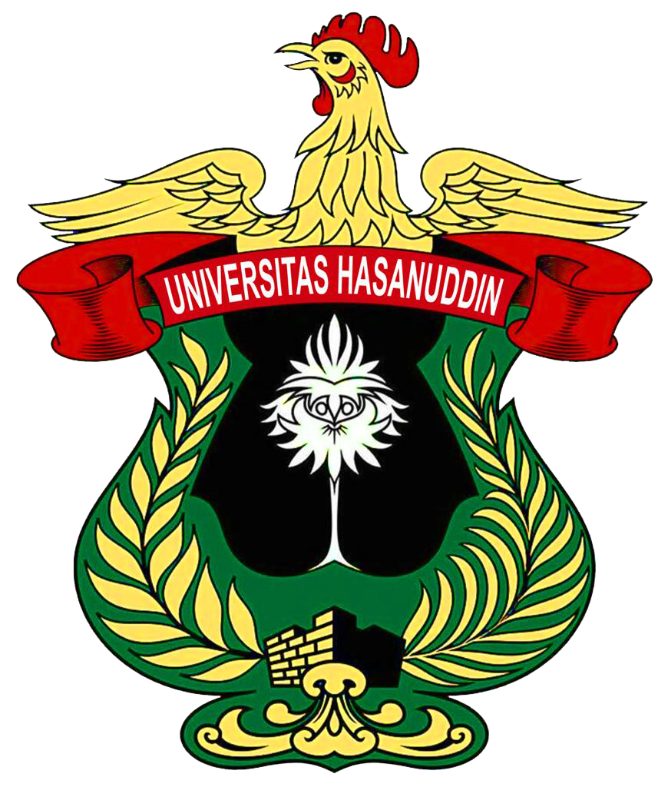

# BAGIAN AWAL PROPOSAL TUGAS AKHIR (FRONT MATTER)

> **Catatan Format Berdasarkan Pedoman Unhas 2023 (SK Rektor No. 10438/UN4.1/KEP/2023)**:  
> Seluruh bagian awal naskah proposal diberi nomor halaman dengan angka romawi kecil (i, ii, iii, iv, v, dst.*) yang diletakkan pada sembir kanan atas. Naskah dicetak pada kertas format B5 (176 mm x 250 mm) atau A4 (disesuaikan dengan kebutuhan seminar proposal di departemen), font utama Arial 10 pt (spasi 1,15), dan judul/subjudul Arial 11 pt ditebalkan (*bold).

---

<!-- ======================================================================= -->
<!-- HALAMAN SAMPUL DEPAN (FRONT COVER)                                      -->
<!-- ======================================================================= -->

<div align="center">

# PROPOSAL TUGAS AKHIR

<br>

### *ANALISIS KINEMATIKA, DINAMIKA, DAN ESTIMASI KEADAAN OPTIMAL *KALMAN FILTER* UNTUK *VISION-BASED TRACKING* PADA OVER-ACTUATED 8-THRUSTER 6-DOF VECTORED AUV*

<br>

*(Analysis of Kinematics, Dynamics, and Optimal Kalman Filter State Estimation for Vision-Based Tracking on an Over-Actuated 8-Thruster 6-DOF Vectored AUV)*

<br><br>

*(Ilustrasi / Desain Grafis Model 3D AUV 8-Pendorong)*  
```text
               [ V5 (Port-Fore) ]      [ V6 (Stbd-Fore) ]
                       \                /
             [ H1 ] ----+--------------+---- [ H2 ]
                        |  ROV PIP     |
                        | (6-DOF HAUV) |
             [ H3 ] ----+--------------+---- [ H4 ]
                       /                \
               [ V7 (Port-Aft) ]       [ V8 (Stbd-Aft) ]
```

<br><br>

**MUH. RADHI SYAFIQ GHANIM. S***NIM. D021201006**

<br><br>



<br><br>

**DEPARTEMEN TEKNIK MESIN***FAKULTAS TEKNIK***UNIVERSITAS HASANUDDIN***MAKASSAR***2026**

</div>

<div style="page-break-after: always;"></div>

---

<!-- ======================================================================= -->
<!-- HALAMAN JUDUL (TITLE PAGE - HALAMAN i)                                  -->
<!-- ======================================================================= -->

<div align="center">

Halaman i (Dihitung, tidak dicetak)

# PROPOSAL TUGAS AKHIR

<br>

### *ANALISIS KINEMATIKA, DINAMIKA, DAN ESTIMASI KEADAAN OPTIMAL *KALMAN FILTER* UNTUK *VISION-BASED TRACKING* PADA OVER-ACTUATED 8-THRUSTER 6-DOF VECTORED AUV*

<br>

ANALYSIS OF KINEMATICS, DYNAMICS, AND OPTIMAL KALMAN FILTER STATE ESTIMATION FOR VISION-BASED TRACKING IN AN OVER-ACTUATED 8-THRUSTER 6-DOF VECTORED AUV

<br><br><br>

**MUH. RADHI SYAFIQ GHANIM. S***NIM. D021201006**

<br><br><br>


<br><br><br>

**DEPARTEMEN TEKNIK MESIN***FAKULTAS TEKNIK***UNIVERSITAS HASANUDDIN***MAKASSAR***2026**

</div>

<div style="page-break-after: always;"></div>

---

<!-- ======================================================================= -->
<!-- HALAMAN PENGAJUAN (SUBMISSION PAGE - HALAMAN ii)                        -->
<!-- ======================================================================= -->

<div align="center">

Halaman ii (Dihitung, tidak dicetak)

### **ANALISIS KINEMATIKA, DINAMIKA, DAN ESTIMASI KEADAAN OPTIMAL *KALMAN FILTER* UNTUK *VISION-BASED TRACKING* PADA *OVER-ACTUATED 8-THRUSTER 6-DOF VECTORED AUV***

<br><br>

**MUH. RADHI SYAFIQ GHANIM. S***NIM. D021201006**

<br><br><br>

**Proposal Tugas Akhir**  
sebagai salah satu syarat untuk mencapai gelar sarjana  
Program Studi Teknik Mesin

<br><br>

pada

<br><br>

**DEPARTEMEN TEKNIK MESIN***FAKULTAS TEKNIK***UNIVERSITAS HASANUDDIN***MAKASSAR***2026**

</div>

<div style="page-break-after: always;"></div>

---

<!-- ======================================================================= -->
<!-- HALAMAN PENGESAHAN (APPROVAL PAGE - HALAMAN iii)                        -->
<!-- ======================================================================= -->

<div align="center">

Halaman iii (Dihitung, tidak dicetak)

# LEMBAR PENGESAHAN PROPOSAL TUGAS AKHIR

<br>

### **ANALISIS KINEMATIKA, DINAMIKA, DAN ESTIMASI KEADAAN OPTIMAL *KALMAN FILTER* UNTUK *VISION-BASED TRACKING* PADA *OVER-ACTUATED 8-THRUSTER 6-DOF VECTORED AUV***

<br>

Disusun dan diajukan oleh:

<br>

**MUH. RADHI SYAFIQ GHANIM. S***NIM. D021201006**

<br><br>

Telah dipertahankan di hadapan Panitia Ujian Seminar Proposal Tugas Akhir  
pada tanggal ......................... 2026  
dan dinyatakan telah memenuhi syarat kelayakan proposal penelitian  
pada Program Studi Teknik Mesin, Departemen Teknik Mesin,  
Fakultas Teknik, Universitas Hasanuddin.

<br><br><br>

</div>

<table style="width:100%; border:none; text-align:center;">
  <tr>
    <td style="width:50%; border:none;">
      Mengesahkan:<br>
      <strong>Pembimbing Utama</strong><br><br><br><br><br>
      <u>(Nama Lengkap Pembimbing Utama & Gelar)</u><br>
      NIP. ....................................................
    </td>
    <td style="width:50%; border:none;">
      Mengesahkan:<br>
      <strong>Pembimbing Pendamping</strong><br><br><br><br><br>
      <u>(Nama Lengkap Pembimbing Pendamping & Gelar)</u><br>
      NIP. ....................................................
    </td>
  </tr>
  <tr>
    <td colspan="2" style="border:none;"><br><br></td>
  </tr>
  <tr>
    <td colspan="2" style="border:none; text-align:center;">
      Mengetahui:<br>
      <strong>Ketua Program Studi Teknik Mesin</strong><br>
      Departemen Teknik Mesin, Fakultas Teknik, Universitas Hasanuddin<br><br><br><br><br>
      <u>(Nama Lengkap Ketua Program Studi & Gelar)</u><br>
      NIP. ....................................................
    </td>
  </tr>
</table>

<div style="page-break-after: always;"></div>

---

<!-- ======================================================================= -->
<!-- ======================================================================= -->
<!-- LEMBAR PERNYATAAN KEASLIAN (STATEMENT OF ORIGINALITY - HALAMAN iii)    -->
<!-- ======================================================================= -->

<div align="center">

*Halaman iii*

# PERNYATAAN KEASLIAN PROPOSAL TUGAS AKHIR DAN PELIMPAHAN HAK CIPTA

</div>

<br>

Dengan ini saya menyatakan bahwa proposal tugas akhir yang berjudul:

<div align="center">
<strong>“ANALISIS KINEMATIKA, DINAMIKA, DAN ESTIMASI KEADAAN OPTIMAL <em>KALMAN FILTER</em> UNTUK <em>VISION-BASED TRACKING</em> PADA <em>OVER-ACTUATED 8-THRUSTER 6-DOF VECTORED AUV</em>”</strong>
</div>

adalah benar merupakan karya ilmiah orisinal saya sendiri di bawah arahan dan bimbingan tim pembimbing:
1. **Pembimbing Utama**: Andi Amijoyo Mochtar, S.T., M.Sc., Ph.D.
2. **Pembimbing Pendamping**: [Nama Lengkap dan Gelar Pembimbing Pendamping]

Karya ilmiah ini belum pernah diajukan dan tidak sedang diajukan dalam bentuk apa pun kepada perguruan tinggi mana pun untuk memperoleh gelar akademik. Semua sumber informasi yang berasal atau dikutip dari karya ilmiah yang diterbitkan maupun tidak diterbitkan dari penulis lain telah dirujuk dan disebutkan dengan benar dalam teks serta dicantumkan dalam Daftar Pustaka naskah ini.

Apabila di kemudian hari terbukti atau dapat dibuktikan bahwa sebagian atau keseluruhan naskah proposal tugas akhir ini merupakan hasil plagiasi, fabrikasi, atau falsifikasi karya orang lain, maka saya bersedia menerima sanksi akademik yang tegas sesuai dengan peraturan perundang-undangan yang berlaku di lingkungan Universitas Hasanuddin dan Republik Indonesia.

Dengan ini saya juga melimpahkan hak cipta (hak ekonomis) dari karya tulis ilmiah ini kepada Universitas Hasanuddin.

<br><br>

<div style="text-align:left; margin-left: 20px;">
  Makassar, ......................... 2026<br>
  Yang membuat pernyataan,<br><br>
  <em>(Materai Rp 10.000,- & Tanda Tangan)</em><br><br><br><br>
  <strong>MUH. RADHI SYAFIQ GHANIM. S</strong><br>
  NIM. D021201006
</div>

<div style="page-break-after: always;"></div>

---

<!-- ======================================================================= -->
<!-- PRAKATA / UCAPAN TERIMA KASIH (PREFACE - HALAMAN iv)                   -->
<!-- ======================================================================= -->

<div align="center">

*Halaman iv*

# PRAKATA

</div>

<br>

Puji dan syukur penulis panjatkan ke hadirat Tuhan Yang Maha Esa atas berkat, rahmat, dan karunia-Nya yang melimpah, sehingga penyusunan naskah proposal tugas akhir yang berjudul *"Analisis Kinematika, Dinamika, dan Estimasi Keadaan Optimal Kalman Filter untuk Vision-Based Tracking pada Over-Actuated 8-Thruster 6-DOF Vectored AUV"* ini dapat diselesaikan dengan baik. Naskah proposal ini disusun sebagai salah satu persyaratan kurikulum akademik untuk memperoleh gelar Sarjana Teknik (S.T.) pada Program Studi Teknik Mesin, Departemen Teknik Mesin, Fakultas Teknik, Universitas Hasanuddin.

Penyelesaian naskah proposal tugas akhir ini tidak lepas dari bimbingan, arahan, dorongan motivasi, serta bantuan berharga dari berbagai pihak. Oleh karena itu, dengan penuh rasa hormat dan kerendahan hati, penulis menyampaikan terima kasih dan penghargaan yang setinggi-tingginya kepada:

1. **Bapak Prof. Dr. Ir. Jamaluddin Jompa, M.Sc.**, selaku Rektor Universitas Hasanuddin.
2. **Bapak Prof. Dr. Eng. Ir. Muhammad Isran Ramli, S.T., M.T.**, selaku Dekan Fakultas Teknik, Universitas Hasanuddin.
3. **Bapak Dr. Muhammad Syahid, S.T., M.T.**, selaku Ketua Departemen Teknik Mesin, Fakultas Teknik, Universitas Hasanuddin.
4. **Bapak/Ibu [Nama Ketua Program Studi & Gelar]**, selaku Ketua Program Studi Teknik Mesin, Fakultas Teknik, Universitas Hasanuddin.
5. **Bapak Andi Amijoyo Mochtar, S.T., M.Sc., Ph.D.**, selaku Pembimbing Utama, yang senantiasa meluangkan waktu, memberikan bimbingan ilmiah yang sangat berharga, arahan matematis yang mendalam, serta teladan profesionalisme dalam penyusunan penelitian ini.
6. **Bapak/Ibu [Nama Pembimbing Pendamping & Gelar]**, selaku Pembimbing Pendamping, atas segala masukan teknis, telaah kritis, saran konstruktif, dan dukungan moril yang senantiasa membimbing penulis.
7. Seluruh Dosen dan Staf Pengajar di lingkungan Program Studi Teknik Mesin dan Departemen Teknik Mesin Universitas Hasanuddin atas bekal keilmuan, wawasan teknik, dan dedikasi akademis yang telah dicurahkan selama masa perkuliahan.
8. Rekan-rekan mahasiswa dan asisten di Laboratorium Mekatronika dan Robotika atas diskusi teknis, kolaborasi ilmiah, dan kebersamaan dalam eksplorasi teknologi subsea robotics.
9. Teristimewa kepada kedua orang tua tercinta, keluarga besar, dan sanak saudara, atas doa tulus yang tak pernah terputus, cinta kasih tanpa pamrih, pengorbanan, dan dorongan moral serta spiritual yang tak ternilai harganya.

Penulis menyadari sepenuhnya bahwa naskah proposal ini masih memiliki ruang untuk penyempurnaan. Oleh karena itu, saran dan kritik konstruktif sangat diharapkan demi penyempurnaan penelitian ini hingga tahap akhir. Semoga penelitian ini dapat memberikan kontribusi nyata bagi perkembangan ilmu pengetahuan dan teknologi kelautan nasional, khususnya dalam rekayasa robotika bawah air.

<br><br>

<table style="width:100%; border:none;">
  <tr>
    <td style="width:50%; border:none;"></td>
    <td style="width:50%; border:none; text-align:center;">
      Makassar, ......................... 2026<br><br>
      Penulis,<br><br><br><br>
      <strong>MUH. RADHI SYAFIQ GHANIM. S</strong>
    </td>
  </tr>
</table>

<div style="page-break-after: always;"></div>

---

<!-- ======================================================================= -->
<!-- ABSTRAK (BAHASA INDONESIA - HALAMAN v)                                  -->
<!-- ======================================================================= -->

<div align="center">

*Halaman v*

# ABSTRAK

**Latar belakang.** Eksplorasi bawah air menuntut wahana otonom dengan fleksibilitas manuver tinggi. Sebagian besar wahana konvensional beroperasi secara *underactuated* tanpa *active control* pada sudut *pitch* serta rentan terhadap *hydrodynamic Munk destabilizing moment*. Wahana *over-actuated 8-thruster* mampu menyediakan *full control authority* pada *6-Degrees of Freedom* (6-DOF), namun menghadirkan tantangan dinamika *coupled nonlinear hydrodynamics* dan degradasi *underwater visual sensing*. **Tujuan.** Penelitian ini bertujuan menurunkan formulasi analitis komprehensif *kinematics* dan *dynamics* 6-DOF Fossen, merancang arsitektur *optimal Kalman Filter suite* untuk *visual target tracking* dan estimasi dinamika wahana, serta memvalidasi *system reliability* melalui integrasi simulasi *Software-In-The-Loop* (SITL) dan pengujian perangkat keras *Hardware-In-The-Loop* (HITL). **Metode.**6-DOF kinematics* diturunkan melalui *rotation group* SO(3), transformasi *Euler angles*, dan representasi *singularity-free unit quaternion*. Persamaan dinamika diturunkan berbasis *Fossen 6-DOF equations of motion*, mencakup *rigid-body inertia matrix*, *hydrodynamic added mass*, *Coriolis-centripetal acceleration matrix*, *nonlinear quadratic damping tensor*, serta *hydrostatic restoring forces and moments*. Estimasi *state* visual menggunakan *Discrete Kalman Filter* (DKF) 8-*state* berbasis model *Continuous White Noise Acceleration* (CWNA) dengan *Mahalanobis distance outlier gating*, sedangkan *vehicle motion dynamics reconstruction* dan *ocean current disturbance observer* menggunakan *Extended Kalman Filter* (EKF) pada *companion computer* Raspberry Pi 4B yang terhubung melalui protokol telemetri MAVLink (50 Hz) dengan *flight controller* Pixhawk 2.4.8 (firmware ArduSub *vectored_6dof*) dan lingkungan simulasi Gazebo Harmonic/ROS 2 Jazzy. **Hasil yang diharapkan.** Diperoleh model analitis 6-DOF Fossen terverifikasi serta algoritma *optimal Kalman Filter suite* yang mampu mereduksi *bounding box jitter* deteksi YOLO, merekonstruksi *body velocity dynamics* dan *ocean current velocity*, serta mempertahankan kestabilan *attitude* 6-DOF secara *real-time*. **Kesimpulan.** Integrasi *6-DOF dynamics modeling* dan *filter*an optimal Kalman memberikan landasan teoretis dan arsitektur *mechatronics* yang tangguh untuk *autonomous underwater inspection*.

<br>

**Kata kunci:**Autonomous Underwater Vehicle* (AUV); *Fossen 6-DOF equations of motion*; *optimal Kalman Filter suite*; *sensor fusion*; *computer vision*; *Hardware-In-The-Loop* (HITL)

<div style="page-break-after: always;"></div>

---

<!-- ======================================================================= -->
<!-- DAFTAR ISI (TABLE OF CONTENTS - HALAMAN vi)                             -->
<!-- ======================================================================= -->

<div align="center">

*Halaman vi*

# DAFTAR ISI

</div>

<br>

<table style="width:100%; border:none; line-height:1.6;">
  <tr>
    <td style="border:none;"><strong>HALAMAN JUDUL</strong></td>
    <td style="border:none; text-align:right;"><strong>i</strong></td>
  </tr>
  <tr>
    <td style="border:none;"><strong>LEMBAR PENGESAHAN PROPOSAL TUGAS AKHIR</strong></td>
    <td style="border:none; text-align:right;"><strong>ii</strong></td>
  </tr>
  <tr>
    <td style="border:none;"><strong>PERNYATAAN KEASLIAN PROPOSAL TUGAS AKHIR</strong></td>
    <td style="border:none; text-align:right;"><strong>iii</strong></td>
  </tr>
  <tr>
    <td style="border:none;"><strong>PRAKATA</strong></td>
    <td style="border:none; text-align:right;"><strong>iv</strong></td>
  </tr>
  <tr>
    <td style="border:none;"><strong>ABSTRAK</strong></td>
    <td style="border:none; text-align:right;"><strong>v</strong></td>
  </tr>
  <tr>
    <td style="border:none;"><strong>DAFTAR ISI</strong></td>
    <td style="border:none; text-align:right;"><strong>vi</strong></td>
  </tr>
  <tr>
    <td style="border:none;"><strong>DAFTAR TABEL</strong></td>
    <td style="border:none; text-align:right;"><strong>vii</strong></td>
  </tr>
  <tr>
    <td style="border:none;"><strong>DAFTAR GAMBAR</strong></td>
    <td style="border:none; text-align:right;"><strong>viii</strong></td>
  </tr>
  <tr>
    <td style="border:none;"><strong>DAFTAR SINGKATAN, ISTILAH, DAN LAMBANG</strong></td>
    <td style="border:none; text-align:right;"><strong>ix</strong></td>
  </tr>
  <tr>
    <td colspan="2" style="border:none;"><hr style="border-top:1px solid #000;"></td>
  </tr>
  <tr>
    <td style="border:none;"><strong>BAB I. PENDAHULUAN</strong></td>
    <td style="border:none; text-align:right;"><strong>1</strong></td>
  </tr>
  <tr>
    <td style="border:none; padding-left:20px;">1.1 Latar Belakang</td>
    <td style="border:none; text-align:right;">1</td>
  </tr>
  <tr>
    <td style="border:none; padding-left:20px;">1.2 Rumusan Masalah</td>
    <td style="border:none; text-align:right;">3</td>
  </tr>
  <tr>
    <td style="border:none; padding-left:20px;">1.3 Tujuan Penelitian</td>
    <td style="border:none; text-align:right;">4</td>
  </tr>
  <tr>
    <td style="border:none; padding-left:20px;">1.4 Batasan Masalah</td>
    <td style="border:none; text-align:right;">5</td>
  </tr>
  <tr>
    <td style="border:none; padding-left:20px;">1.5 Manfaat Penelitian</td>
    <td style="border:none; text-align:right;">6</td>
  </tr>

  <tr>
    <td colspan="2" style="border:none;"><br></td>
  </tr>
  <tr>
    <td style="border:none;"><strong>BAB II. TINJAUAN PUSTAKA</strong></td>
    <td style="border:none; text-align:right;"><strong>7</strong></td>
  </tr>
  <tr>
    <td style="border:none; padding-left:20px;">2.1 Tinjauan Pustaka (*State of the Art* Penelitian AUV)</td>
    <td style="border:none; text-align:right;">7</td>
  </tr>
  <tr>
    <td style="border:none; padding-left:20px;">2.2 Sistem Koordinat dan Konvensi SNAME</td>
    <td style="border:none; text-align:right;">11</td>
  </tr>
  <tr>
    <td style="border:none; padding-left:20px;">2.3 Penurunan *6-DOF kinematics* dan Matriks Jacobian</td>
    <td style="border:none; text-align:right;">15</td>
  </tr>
  <tr>
    <td style="border:none; padding-left:20px;">2.4 Penurunan Dinamika Hidro*6-DOF dynamics* (Persamaan Fossen)</td>
    <td style="border:none; text-align:right;">19</td>
  </tr>
  <tr>
    <td style="border:none; padding-left:20px;">2.5 Teori dan Formulasi Optimal *Kalman Filter* Suite</td>
    <td style="border:none; text-align:right;">26</td>
  </tr>

  <tr>
    <td colspan="2" style="border:none;"><br></td>
  </tr>
  <tr>
    <td style="border:none;"><strong>BAB III. METODOLOGI PENELITIAN</strong></td>
    <td style="border:none; text-align:right;"><strong>42</strong></td>
  </tr>
  <tr>
    <td style="border:none; padding-left:20px;">3.1 Tempat dan Waktu Penelitian</td>
    <td style="border:none; text-align:right;">42</td>
  </tr>
  <tr>
    <td style="border:none; padding-left:20px;">3.2 Diagram Alir Penelitian</td>
    <td style="border:none; text-align:right;">43</td>
  </tr>
  <tr>
    <td style="border:none; padding-left:20px;">3.3 Identifikasi Parameter Fisik dan Hidrodinamika Wahana</td>
    <td style="border:none; text-align:right;">45</td>
  </tr>
  <tr>
    <td style="border:none; padding-left:20px;">3.4 Perancangan Arsitektur *Software-In-The-Loop* (SITL)</td>
    <td style="border:none; text-align:right;">51</td>
  </tr>
  <tr>
    <td style="border:none; padding-left:20px;">3.5 Perancangan Arsitektur *Hardware-In-The-Loop* (HITL)</td>
    <td style="border:none; text-align:right;">52</td>
  </tr>
  <tr>
    <td style="border:none; padding-left:20px;">3.6 Prosedur Pengujian dan Evaluasi Kinerja</td>
    <td style="border:none; text-align:right;">61</td>
  </tr>

  <tr>
    <td colspan="2" style="border:none;"><hr style="border-top:1px solid #000;"></td>
  </tr>
  <tr>
    <td style="border:none;"><strong>DAFTAR PUSTAKA</strong></td>
    <td style="border:none; text-align:right;"><strong>64</strong></td>
  </tr>
</table>

<div style="page-break-after: always;"></div>

---

<!-- ======================================================================= -->
<!-- DAFTAR TABEL & DAFTAR GAMBAR (HALAMAN vii & viii)                       -->
<!-- ======================================================================= -->

<div align="center">

*Halaman vii*

# DAFTAR TABEL

</div>

<br>

<table style="width:100%; border:none; line-height:1.6;">
  <tr>
    <td style="border:none; width:18%;"><strong>Nomor Urut</strong></td>
    <td style="border:none; width:67%;"><strong>Judul Tabel</strong></td>
    <td style="border:none; width:15%; text-align:right;"><strong>Halaman</strong></td>
  </tr>
  <tr>
    <td style="border:none;">Tabel 2.1</td>
    <td style="border:none;">Matriks Sintesis Literatur Terkini (2021–2025) Bidang Dinamika dan Kontrol AUV</td>
    <td style="border:none; text-align:right;">8</td>
  </tr>
  <tr>
    <td style="border:none;">Tabel 2.2</td>
    <td style="border:none;">Notasi dan Konvensi 6 Derajat Kebebasan SNAME (1950) & Fossen (2021)</td>
    <td style="border:none; text-align:right;">14</td>
  </tr>
  <tr>
    <td style="border:none;">Tabel 3.1</td>
    <td style="border:none;">Parameter Fisik dan Properti Benda Tegar Acuan Nominal Model Simulasi SITL</td>
    <td style="border:none; text-align:right;">43</td>
  </tr>
  <tr>
    <td style="border:none;">Tabel 3.2</td>
    <td style="border:none;">Koefisien Derivatif *hydrodynamic added mass* Acuan Simulasi SITL</td>
    <td style="border:none; text-align:right;">44</td>
  </tr>
  <tr>
    <td style="border:none;">Tabel 3.3</td>
    <td style="border:none;">Koefisien Redaman Hidrodinamika Acuan Simulasi SITL</td>
    <td style="border:none; text-align:right;">46</td>
  </tr>
  <tr>
    <td style="border:none;">Tabel 3.4</td>
    <td style="border:none;">Posisi Spasial dan Vektor Satuan Gaya Dorong 8-Pendorong Acuan Geometri Kerangka</td>
    <td style="border:none; text-align:right;">47</td>
  </tr>
  <tr>
    <td style="border:none;">Tabel 3.5</td>
    <td style="border:none;">Spesifikasi Komponen Perangkat Keras Arsitektur HITL</td>
    <td style="border:none; text-align:right;">50</td>
  </tr>
</table>

<div style="page-break-after: always;"></div>

<div align="center">

*Halaman viii*

# DAFTAR GAMBAR

</div>

<br>

<table style="width:100%; border:none; line-height:1.6;">
  <tr>
    <td style="border:none; width:18%;"><strong>Nomor Urut</strong></td>
    <td style="border:none; width:67%;"><strong>Judul Gambar</strong></td>
    <td style="border:none; width:15%; text-align:right;"><strong>Halaman</strong></td>
  </tr>
  <tr>
    <td style="border:none;">Gambar 2.1</td>
    <td style="border:none;">Sistem *North-East-Down (NED) inertial frame* (Fn - NED) dan *body-fixed frame* (Fb - FRD) Konvensi SNAME (1950) dan Fossen (2021)</td>
    <td style="border:none; text-align:right;">11</td>
  </tr>
  <tr>
    <td style="border:none;">Gambar 3.1</td>
    <td style="border:none;">Diagram Alir Tahapan Penelitian Komprehensif</td>
    <td style="border:none; text-align:right;">44</td>
  </tr>
  <tr>
    <td style="border:none;">Gambar 3.2</td>
    <td style="border:none;">Arsitektur Simulasi Software-In-The-Loop (SITL) Sistem AUV</td>
    <td style="border:none; text-align:right;">51</td>
  </tr>
  <tr>
    <td style="border:none;">Gambar 3.3</td>
    <td style="border:none;">Arsitektur Integrasi Hardware-In-The-Loop (HITL) Mekatronika AUV</td>
    <td style="border:none; text-align:right;">53</td>
  </tr>
  <tr>
    <td style="border:none;">Gambar 3.4</td>
    <td style="border:none;">Rangka (Frame) dan Lambung Tekanan Kustom AUV 8-Pendorong</td>
    <td style="border:none; text-align:right;">55</td>
  </tr>
  <tr>
    <td style="border:none;">Gambar 3.5</td>
    <td style="border:none;">*flight controller* Pixhawk 2.4.8</td>
    <td style="border:none; text-align:right;">55</td>
  </tr>
  <tr>
    <td style="border:none;">Gambar 3.6</td>
    <td style="border:none;">*companion computer* Raspberry Pi 4B</td>
    <td style="border:none; text-align:right;">56</td>
  </tr>
  <tr>
    <td style="border:none;">Gambar 3.7</td>
    <td style="border:none;">Modul Pengendali Kecepatan Elektronik (ESC EMAX BLHeli 30A)</td>
    <td style="border:none; text-align:right;">56</td>
  </tr>
  <tr>
    <td style="border:none;">Gambar 3.8</td>
    <td style="border:none;">motor *BLDC underwater thruster*</td>
    <td style="border:none; text-align:right;">57</td>
  </tr>
  <tr>
    <td style="border:none;">Gambar 3.9</td>
    <td style="border:none;">Sumber Daya Utama Baterai Li-Po 4S 14.8V 6000 mAh</td>
    <td style="border:none; text-align:right;">57</td>
  </tr>
  <tr>
    <td style="border:none;">Gambar 3.10</td>
    <td style="border:none;">Modul Kamera Sistem Pelacakan Visual: Raspberry Pi Camera Rev 1.3 dan Webcam Logitech C922 Pro</td>
    <td style="border:none; text-align:right;">58</td>
  </tr>
</table>

<div style="page-break-after: always;"></div>

---

<!-- ======================================================================= -->
<!-- DAFTAR SINGKATAN, ISTILAH, DAN LAMBANG (HALAMAN ix)                     -->
<!-- ======================================================================= -->

<div align="center">

*Halaman ix*

# DAFTAR SINGKATAN, ISTILAH, DAN LAMBANG

</div>

<br>

### 1. Daftar Singkatan

| Singkatan | Kepanjangan / Arti Teknis |
| :--- | :--- |
| *AUV* | *Autonomous Underwater Vehicle* (*Autonomous Underwater Vehicle*) |
| *HAUV* | *Hovering Autonomous Underwater Vehicle* (*Hovering AUV*) |
| *ROV* | *Remotely Operated Vehicle* (*Remotely Operated Vehicle*) |
| *DOF* | *Degrees of Freedom* (*spatial degrees of freedom*) |
| *SNAME* | *The Society of Naval Architects and Marine Engineers* |
| *NED* | *North-East-Down* (*Earth-fixed inertial coordinate system*: Utara-Timur-Bawah) |
| *FRD* | *Forward-Right-Down* (*body-fixed coordinate system*: Maju-Kanan-Bawah) |
| *CG* | *Center of Gravity* (*Center of Gravity*) |
| *CB* | *Center of Buoyancy* (*Center of Buoyancy*) |
| *CO* | *Center of Origin* (Pusat Titik Acuan Kerangka Bodi) |
| *CWNA* | *Continuous White Noise Acceleration* (Model Stokastik Penjejakan Kinematik) |
| *EKF* | *Extended Kalman Filter* (*Non-Linear Kalman Filter*) |
| *UKF* | *Unscented Kalman Filter* (*Unscented Kalman Filter*) |
| *SITL* | *Software-In-The-Loop* (*Software-In-The-Loop simulation*) |
| *HITL* | *Hardware-In-The-Loop* (*Hardware-In-The-Loop testing*) |
| *YOLO* | *You Only Look Once* (*Object Detection Convolutional Neural Network Architecture*) |
| *ROS* | *Robot Operating System* (*Middleware* Komunikasi Robotika) |
| *MAVLink* | *Micro Air Vehicle Link* (Protokol Telemetri Biner Serial Robotika Otonom) |
| *PWM* | *Pulse Width Modulation* (*Pulse Width Modulation signal for motor control*) |
| *ESC* | *Electronic Speed Controller* (*Brushless Motor Speed Controller*) |
| *IMU* | *Inertial Measurement Unit* (*Inertial Measurement Unit: Accelerometer & Gyroscope*) |
| *DVL* | *Doppler Velocity Log* (*Acoustic Sensor for Water Relative Velocity*) |

<br>

### 2. Daftar Lambang dan Simbol Matematika

| Simbol | Dimensi / Satuan | Definisi Matematis dan Fisik |
| :--- | :---: | :--- |
| $$\mathcal{F}^n$$ | - | *North-East-Down (NED) inertial frame* (*Earth-Fixed NED Frame*) $$\{O_n, x_n, y_n, z_n\}$$ |
| $$\mathcal{F}^b$$ | - | *body-fixed frame* (*Body-Fixed Frame*) $$\{O_b, x_b, y_b, z_b\}$$ |
| $$\boldsymbol{\eta}$$ | $$\mathbb{R}^6$$ | *spatial position and orientation vector* di $$\mathcal{F}^n$$: $$[x, y, z, \phi, \theta, \psi]^T$$ |
| $$\boldsymbol{\nu}$$ | $$\mathbb{R}^6$$ | *linear and angular velocity vector* di $$\mathcal{F}^b$$: $$[u, v, w, p, q, r]^T$$ |
| $$\boldsymbol{\tau}$$ | $$\mathbb{R}^6$$ | *generalized forces and moments vector* di $$\mathcal{F}^b$$: $$[X, Y, Z, K, M, N]^T$$ |
| $$\boldsymbol{\nu}_c$$ | $$\mathbb{R}^6$$ | *ocean current velocity vector in body frame* $$[u_c, v_c, w_c, 0, 0, 0]^T$$ |
| $$\boldsymbol{\nu}_r$$ | $$\mathbb{R}^6$$ | *relative velocity vector of the vehicle*: $$\boldsymbol{\nu} - \boldsymbol{\nu}_c$$ |
| $$\mathbf{R}_b^n(\boldsymbol{\eta}_2)$$ | $$SO(3)$$ | *orthogonal rotation transformation matrix* dari $$\mathcal{F}^b$$ ke $$\mathcal{F}^n$$ |
| $$\mathbf{T}_\Theta(\boldsymbol{\eta}_2)$$ | $$\mathbb{R}^{3 \times 3}$$ | *Euler angle rate transformation matrix*: $$\dot{\boldsymbol{\eta}}_2 = \mathbf{T}_\Theta \boldsymbol{\nu}_2$$ |
| $$\mathbf{J}(\boldsymbol{\eta}_2)$$ | $$\mathbb{R}^{6 \times 6}$$ | *kinematic Jacobian matrix* gabungan: $$\text{diag}[\mathbf{R}_b^n, \mathbf{T}_\Theta]$$ |
| $$\mathbf{q}$$ | $$S^3$$ | *four-dimensional unit quaternion orientation*: $$[\eta, \epsilon_1, \epsilon_2, \epsilon_3]^T$$ |
| $$\mathbf{M}_{RB}$$ | $$\mathbb{R}^{6 \times 6}$$ | *rigid-body mass inertia tensor* (*rigid-body mass matrix*) |
| $$\mathbf{M}_A$$ | $$\mathbb{R}^{6 \times 6}$$ | Tensor *hydrodynamic added mass* (*hydrodynamic added mass*) |
| $$\mathbf{M}$$ | $$\mathbb{R}^{6 \times 6}$$ | Tensor massa sistem total gabungan: $$\mathbf{M} = \mathbf{M}_{RB} + \mathbf{M}_A$$ |
| $$\mathbf{C}_{RB}(\boldsymbol{\nu})$$ | $$\mathbb{R}^{6 \times 6}$$ | Matriks Coriolis and centripetal of rigid-body |
| $$\mathbf{C}_A(\boldsymbol{\nu}_r)$$ | $$\mathbb{R}^{6 \times 6}$$ | Matriks Coriolis dan sentripetal *hydrodynamic added mass* |
| $$\mathbf{D}(\boldsymbol{\nu}_r)$$ | $$\mathbb{R}^{6 \times 6}$$ | *combined hydrodynamic damping tensor* (linier laminar $$\mathbf{D}_L$$ + kuadratik $$\mathbf{D}_{NL}$$) |
| $$\mathbf{g}(\boldsymbol{\eta})$$ | $$\mathbb{R}^6$$ | Vektor *hydrostatic restoring forces and moments* (gravitasi dan gaya apung) |
| $$GM_T$$ | $$\text{m}$$ | *transverse metacentric height*: $$z_g - z_b$$ |
| $$\mathbf{x}_{k}$$ | $$\mathbb{R}^8$$ | *visual tracking state vector*: $$[x, y, s, r, \dot{x}, \dot{y}, \dot{s}, \dot{r}]^T$$ |
| $$\mathbf{P}_k$$ | $$\mathbb{R}^{8 \times 8}$$ | *estimation error covariance matrix* (*error covariance matrix*) |
| $$\mathbf{K}_k$$ | - | Matriks *optimal Kalman gain* (*optimal Kalman gain*) |
| $$\mathbf{Q}$$ | - | *covariance matrix*process noise* (*process noise covariance matrix*) |
| $$\mathbf{R}$$ | - | *covariance matrix*measurement noise* (*measurement noise covariance matrix*) |
| $$D_M$$ | - | *Mahalanobis squared distance* untuk *outlier innovation gating* |
